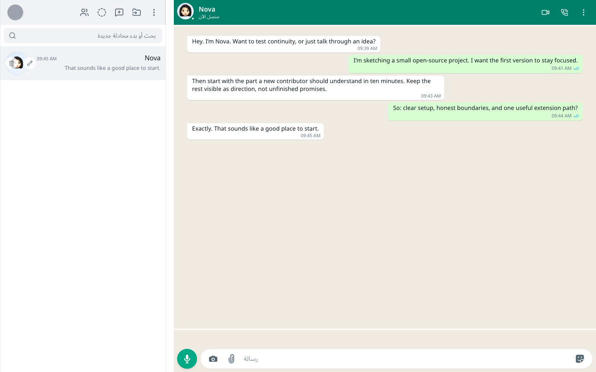
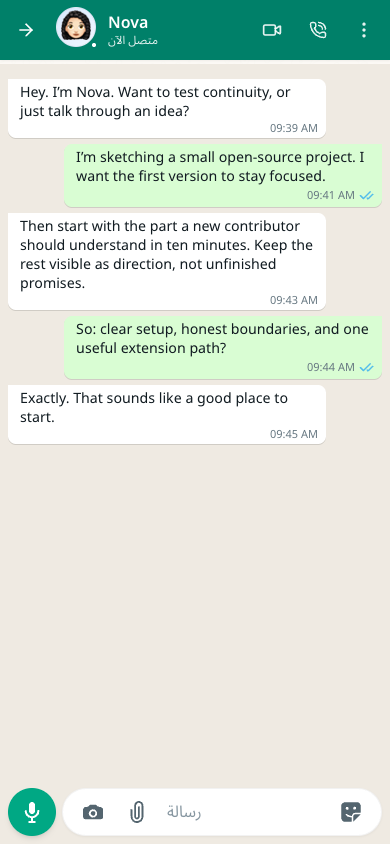
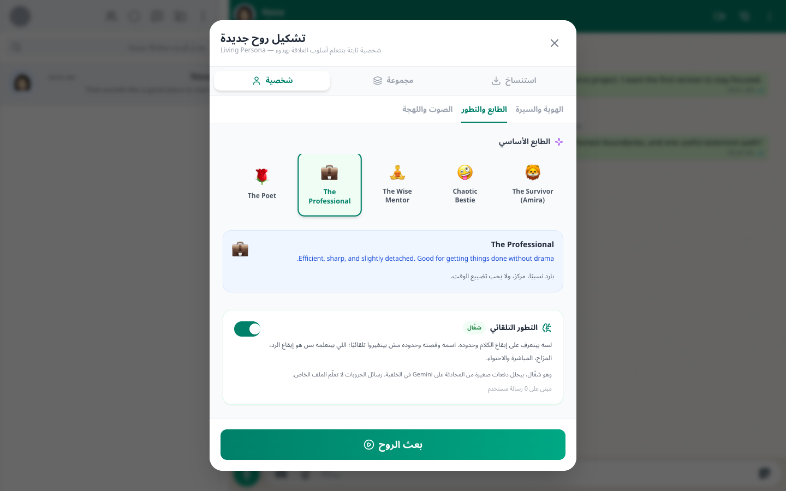
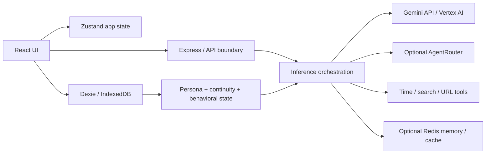

<p align="center">
  
</p>

<h1 align="center">Rafiq</h1>

<p align="center"><strong>Open-source, local-first AI companion runtime for persistent personas, memory, tools, multimodal workflows, and localizable conversation</strong></p>

<p align="center">Rafiq began with deep Egyptian-Arabic experimentation because everyday dialect exposes unnatural conversation quickly. The open-source core now separates locale, timezone, direction, culture, persona, and provider so that origin does not become a global product boundary.</p>

<p align="center">
  <a href="#demo">View demo</a> ·
  <a href="https://vercel.com/new/clone?repository-url=https%3A%2F%2Fgithub.com%2FimMamdouhaboammar%2FRafiq-Bot">Deploy to Vercel</a> ·
  <a href="https://github.com/imMamdouhaboammar/Rafiq-Bot/fork">Fork</a> ·
  <a href="https://github.com/imMamdouhaboammar/Rafiq-Bot">Star on GitHub</a> ·
  <a href="https://github.com/imMamdouhaboammar/Rafiq-Bot/issues/new?template=bug.yml">Report a bug</a> ·
  <a href="https://github.com/imMamdouhaboammar/Rafiq-Bot/issues/new?template=feature.yml">Suggest a feature</a>
</p>

<p align="center">
  <a href="https://github.com/imMamdouhaboammar/Rafiq-Bot/actions/workflows/ci.yml"></a>
  <a href="LICENSE"></a>
</p>

## Why Rafiq exists

Most AI chat products are highly capable, but the interaction can still feel temporary. A new chat can mean starting the relationship again, personality can collapse into one static prompt, and memory can become retrieval without a believable sense of continuity.

Rafiq started as an experiment around a harder question: what changes when a companion has persistent identity, evolving relationship context, memory, behavioral state, culturally natural language, and continuity beyond one prompt?

Egyptian Arabic was the first serious test bed because colloquial language is unforgiving. If a companion sounds unnatural in the language people use with friends every day, the gap is obvious. The underlying problem is not Egyptian, though. The OSS version is therefore moving toward a core that can support different languages, locales, timezones, directions, cultures, personas, and inference paths without silently inheriting Egyptian defaults.

Rafiq is not intended to replace human relationships or provide clinical or therapeutic treatment.

## What Rafiq is

Rafiq is a TypeScript/React companion application with browser-local persistence, server-side inference integrations, configurable personas, continuity state, optional memory infrastructure, realtime tools, media workflows, group conversations, and WhatsApp-export persona analysis. It can run with Google Gemini API or Vertex AI as the primary inference path, with additional integrations documented according to what the code actually reaches today.

## Demo

These captures come from the current OSS branch running locally with synthetic data. No personal chats, WhatsApp exports, local paths, or real credentials are used.

| Desktop conversation | Mobile conversation |
| --- | --- |
|  |  |

### Persona configuration



The browser QA behind these captures uses a 1440x900 desktop viewport and a 390x844 mobile viewport with an `en-US`, `UTC`, LTR runtime. The current interface still contains Arabic strings, so this repository does not claim complete UI translation yet.

## Capabilities

| Capability | Status | Notes |
| --- | --- | --- |
| Persistent persona and behavioral state | Available now | Persona configuration, psychology state, continuity, and adaptive communication behavior |
| Browser-local chat persistence | Available now | Dexie/IndexedDB stores chats, messages, profiles, and local memory data |
| Direct and group conversation flows | Available now | Direct personas and multi-member groups use the same local application shell |
| WhatsApp export persona analysis | Available now | Parses exported chat text and can build a progressively analyzed clone profile |
| Gemini API / Vertex AI inference | Available now | Primary integrated inference paths |
| AgentRouter gateway | Optional | Integrated for recognized model IDs when gateway credentials are configured |
| Redis vector memory | Optional | Remote memory path; local behavior remains available without it |
| Redis LangCache | Optional | Semantic response cache when explicitly configured |
| Web search and URL reading | Optional | Requires a configured search provider; unavailable paths fail honestly |
| Image and media workflows | Provider-dependent | Current integrated flows use the Google inference stack |
| KoboldCpp local adapter | Experimental integration seam | Adapter and tests exist, but it is not wired into the main chat provider selector |

See the [provider matrix](docs/providers/README.md) for the current integration boundary.

## Architecture



The browser/server boundary is deliberate: client components own interaction and local state, while provider credentials and Node-only integrations stay server-side. Start with the [architecture overview](docs/architecture/overview.md) before changing those boundaries.

## Quick start

### Prerequisites

- Bun
- a recent Node-compatible runtime environment
- one Google inference path: Gemini API key or Vertex AI credentials

```bash
git clone https://github.com/imMamdouhaboammar/Rafiq-Bot.git
cd Rafiq-Bot
bun install --frozen-lockfile
cp .env.example .env.local
```

For a minimal local setup, configure one inference path plus the application access gate in `.env.local`:

```env
GEMINI_API_KEY=
RAFIQ_APP_PASSWORD_HASH=
RAFIQ_APP_SESSION_SECRET=
```

`RAFIQ_APP_PASSWORD_HASH` is a SHA-256 hex digest of the password you choose. `RAFIQ_APP_SESSION_SECRET` must be an independent value with at least 32 characters. Do not reuse the password hash as the session secret and never commit `.env.local`.

Start the combined Express and Vite development server:

```bash
bun run dev
```

Open `http://localhost:3000` and sign in with the password whose digest you configured.

For Vertex AI and optional services, use the [environment reference](docs/configuration/env-reference.md) rather than guessing variable names.

## Verification

```bash
bun run typecheck
bun run test:p0
bun test
bun run security:scan
bun run build
```

The full test command uses Bun test discovery. Documentation does not hardcode a test count because the suite changes over time.

## Configuration

The public configuration contract has two maintained surfaces:

- `.env.example` for safe names and placeholders
- [docs/configuration/env-reference.md](docs/configuration/env-reference.md) for required/optional classification and behavior

A contract test checks runtime environment reads against those surfaces. Real values belong only in local or deployment secret stores.

## AI providers

The current main runtime supports Google Gemini API and Vertex AI. AgentRouter is an optional gateway path. A tested KoboldCpp adapter exists as a local integration seam but is not yet connected to the primary UI model selector.

Rafiq does not currently advertise direct consumer-subscription OAuth for ChatGPT/OpenAI, Claude/Anthropic, OpenRouter, Grok, or other vendors. A model name available through a gateway is not the same thing as direct authentication with that provider.

- [Provider matrix](docs/providers/README.md)
- [Adding a provider](docs/providers/adding-a-provider.md)

## Localization

The shared runtime resolves locale, timezone, text direction, conversation language, culture, search locale, and search region separately. With no explicit configuration, the public fallback is `en-US`, `UTC`, and LTR.

`ar-EG` remains a first-class reference culture with intentionally Egyptian conversational capabilities. Non-Egyptian locales do not receive hidden Cairo or Egyptian system framing from the global runtime path.

The interface still contains Arabic copy in several components. Runtime globalization is therefore further along than complete UI translation.

See [localization and cultural presets](docs/localization/README.md).

## Deploy

<a href="https://vercel.com/new/clone?repository-url=https%3A%2F%2Fgithub.com%2FimMamdouhaboammar%2FRafiq-Bot"></a>

A minimum deployment needs the application access gate plus one working inference path. Optional Redis, search, AgentRouter, and Vertex-specific variables can be added later.

Read the [deployment guide](docs/deployment/deployment.md) before treating a hosted instance as production-ready. The guide separates minimum configuration from optional services and advanced Google Cloud setup.

For self-hosting, `bun run build` creates the Vite production bundle and `NODE_ENV=production bun run start` serves `dist/` through the Express application.

## Extend Rafiq

Contributions should extend existing seams rather than create parallel configuration or provider definitions.

- Providers: [adding a provider](docs/providers/adding-a-provider.md)
- Locales and cultural behavior: [localization guide](docs/localization/README.md)
- Personas and soul definitions: [CONTRIBUTING.md](CONTRIBUTING.md#persona-and-soul-contributions)
- Tools: [CONTRIBUTING.md](CONTRIBUTING.md#tool-contributions)
- Repository development: [development guide](docs/guides/development.md)
- Tests: [testing guide](docs/guides/testing.md)

## Privacy and security

Rafiq keeps core application state in the browser through IndexedDB. That does not mean every feature is offline: configured AI providers receive the content required for inference, optional search providers receive search queries, and optional Redis-backed features store the data their feature contracts require.

WhatsApp exports and uploaded media can contain highly personal data. Use synthetic fixtures for contribution screenshots and bug reports. Keep service credentials, provider tokens, session secrets, private chat exports, and machine-specific Agent Kernel state out of Git.

- [Security policy](SECURITY.md)
- [Environment reference](docs/configuration/env-reference.md)
- [Credential rotation runbook](docs/security/credential-rotation-runbook.md)

## Contributing

Start with [CONTRIBUTING.md](CONTRIBUTING.md). It covers setup, verification, branch discipline, provider/localization boundaries, and what must never be committed.

Good contributions are narrow, testable, and honest about current product boundaries. If you are new to the repository, a focused documentation fix, deterministic regression test, accessibility improvement, or issue labeled `good first issue` is a better entry point than a broad rewrite.

## Community

- [Bug report](https://github.com/imMamdouhaboammar/Rafiq-Bot/issues/new?template=bug.yml)
- [Feature proposal](https://github.com/imMamdouhaboammar/Rafiq-Bot/issues/new?template=feature.yml)
- [Setup or contributor question](https://github.com/imMamdouhaboammar/Rafiq-Bot/issues/new?template=question.yml)
- [Support routing](SUPPORT.md)
- [Code of Conduct](CODE_OF_CONDUCT.md)

Security reports should follow [SECURITY.md](SECURITY.md) rather than a public issue.

## Roadmap

The public roadmap tracks outcomes rather than internal sprint plans. Current direction includes clearer provider boundaries, more localization work, better local inference integration, portability of companion data, accessibility/mobile refinement, and measured performance improvements.

See [ROADMAP.md](ROADMAP.md).

## FAQ

### Can I self-host Rafiq?

Yes. The repository includes a Bun/Node Express server, a Vite production build, and a Vercel configuration. You are responsible for provider credentials and deployment security.

### Which AI providers work today?

Google Gemini API and Vertex AI are the primary integrated inference paths. AgentRouter is optional. KoboldCpp has a tested adapter but is not yet the main chat provider path.

### Does Rafiq work beyond Arabic?

The runtime supports configurable locale, timezone, LTR/RTL direction, conversation language, culture hints, and search region without forcing Egyptian defaults. Repository-wide locale and timezone defaults are configurable today, while per-persona locale fields are currently a programmatic/import surface rather than a public settings screen. The UI still contains Arabic strings, so complete UI translation is not yet claimed.

### Is Egyptian Arabic being removed?

No. It remains a first-class reference localization and an important part of the project's origin. The architectural change is that Egyptian behavior is explicit rather than a hidden global default.

### Is all data local?

No. Core app state is browser-local, but inference, search, and optional remote memory/cache features can send data to configured external services. Review each provider boundary before using sensitive data.

### Can I add another provider?

Yes, but provider support should be implemented and tested before it is advertised. Start with [docs/providers/adding-a-provider.md](docs/providers/adding-a-provider.md).

## Documentation

- [Documentation index](docs/README.md)
- [Getting started](docs/guides/getting-started.md)
- [Architecture overview](docs/architecture/overview.md)
- [Environment reference](docs/configuration/env-reference.md)
- [Deployment](docs/deployment/deployment.md)
- [Testing](docs/guides/testing.md)
- [Agent Kernel maintainer workflow](docs/guides/agent-kernel.md)

## License and citation

Rafiq is available under the [MIT License](LICENSE). For research use, GitHub can render the repository citation metadata from [CITATION.cff](CITATION.cff); the longer research manuscript lives under [docs/research-paper/](docs/research-paper/).
