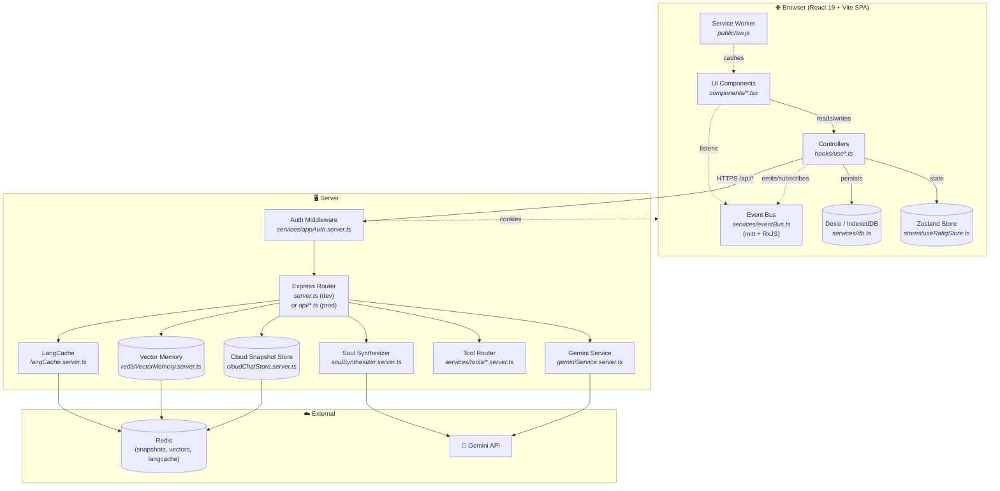
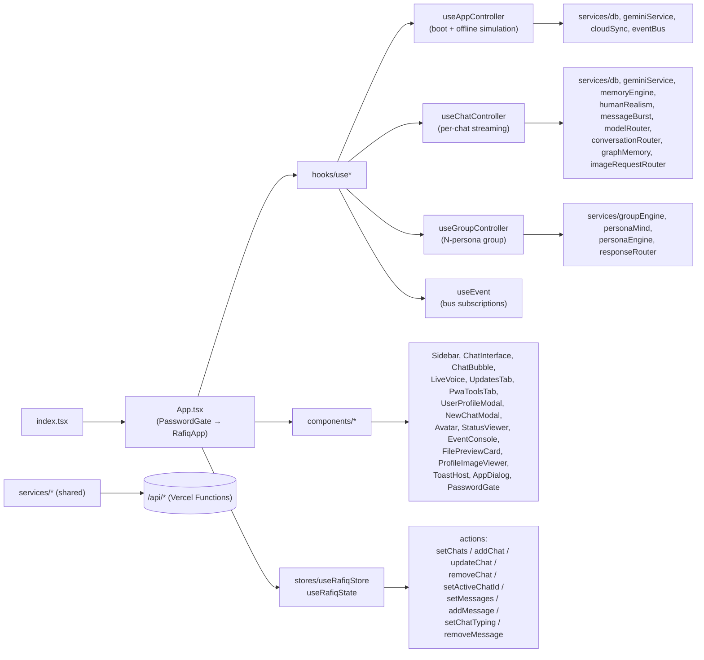
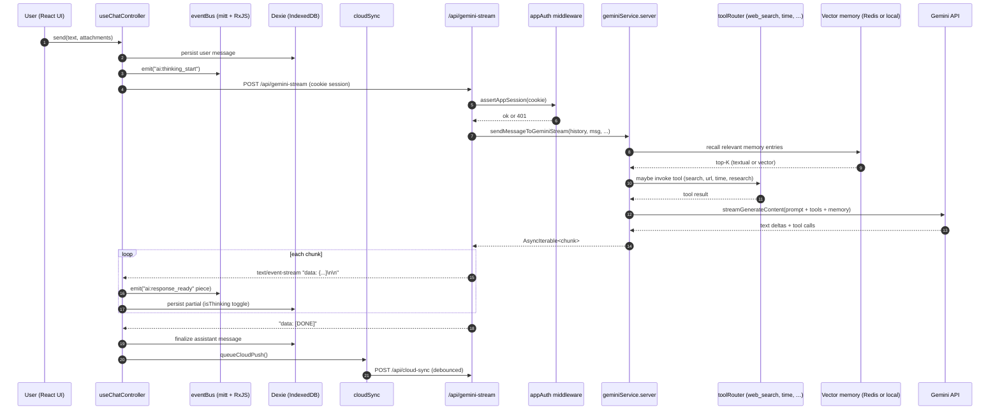

# Rafiq — Human-like AI Companion

> **Arabic-speaking, multimodal AI companion** with persistent memory, a customizable "Soul Engine" personality layer, group-chat simulation, and a real-time cloud sync bridge. Built as a single-codebase full-stack app: React 19 + Vite SPA in the browser, Express server in development, Vercel Functions in production.

---

## What is Rafiq?

Rafiq (رفيق — "companion") is an AI chat product designed to feel **less like a tool and more like a person**. It is opinionated about three things:

1. **Multimodal by default.** Text, streaming, image generation, avatar selfies, Studio-grade image editing, VEO video, and live voice — all reachable from one chat surface.
2. **Persistent psychological state.** Every persona has a `PsychologicalState` (mood, energy, social meter, emotional ledger, hunger, financial stress, sleepiness, breakup state) that mutates between sessions and across the day.
3. **A "Soul Engine" instead of a single system prompt.** Each persona is a `SoulDefinition` with five tunable traits — `chaos`, `empathy`, `slang`, `intellect`, `positivity` — combined with a dialect (`cairo_modern`, `alexandrian`, `saidi`, `fusha_light`, `franko`), a voice tone/pitch/speed, and a long-form identity kernel.

The "WhatsApp-Clone Pipeline" takes a real WhatsApp export (`.txt`), parses participants and linguistic patterns, builds a `SoulBlueprint`, and instantiates a new persona whose voice matches the originals.

---

## ✨ Highlights

| Capability | Where it lives |
|---|---|
| Streaming chat with Gemini (thinking + non-thinking modes) | `services/geminiService.{ts,server.ts}` → `api/gemini-stream.ts` |
| App-password gate + signed cookie session | `services/appAuth.server.ts` → `components/PasswordGate.tsx` → `api/auth-login.ts` |
| Group chat with N AI personas, reactions, perception routing | `services/groupEngine.ts` → `hooks/useGroupController.ts` |
| WhatsApp-chat import → SoulBlueprint → live persona | `services/whatsappImporter*` → `soulSynthesizer*` → `services/soul.ts` |
| Multimodal generation (image, selfie, avatar, studio, video) | `services/visualEngine.ts` → `api/gemini.ts` actions |
| Real-time human-realism layer (fragmented bubbles, typos, emoji protocol, emotional ledger) | `services/humanRealism.ts` + `dynamicEngines.ts` + `messageBurst.ts` |
| Persistent local memory (long-term facts, identity, preferences) | `services/memoryEngine.ts` + Dexie store in `services/db.ts` |
| Optional server-side vector memory (Redis Iris / Redis Stack) | `services/redisVectorMemory.server.ts` + `graphMemory.server.ts` |
| Optional LangCache semantic response cache | `services/langCache.server.ts` |
| Cloud snapshot sync across devices (auth-gated) | `services/chatTransfer.ts` (local) |
| Tool calling (web search, URL reader, current time, deep research) | `services/tools/*.server.ts` → `toolRouter.server.ts` |
| Autonomous messaging (persona initiates when user is offline) | `hooks/useAppController.ts` (`runBackgroundStartupWork`) |
| PWA install + offline service worker | `public/sw.js` + `public/manifest.webmanifest` |
| Memory snapshots & import/export of whole chats | `services/chatTransfer.ts` |

---

## 🛠 Tech stack

**Frontend** · React 19 · TypeScript 5.8 · Vite 6 · Framer Motion 11 · Lucide Icons  
**State** · Zustand 5 (single store) · Dexie 4 (IndexedDB) · RxJS 7 + mitt (event bus)  
**Validation** · Zod 3 (every persisted entity is schema-validated)  
**AI** · `@google/genai` 1.30 · `ai` 4.1 · `@ai-sdk/google` 1.1  
**Cache / Vector memory** · Redis (`@redis-iris/agent-memory` or self-hosted Redis Stack) · LangCache  
**Backend (dev)** · Node + Express 5 + tsx (Vite middleware mode, single port)  
**Backend (prod)** · Vercel Functions (`api/*.ts`) + static `dist/`  
**Other** · Service Worker / PWA · Express body limit `50mb` for base64 attachments

---

## 📐 Code graph

### High-level architecture



### Frontend module graph



### Chat request lifecycle (the important one)



---

## 📁 Project layout

```
Rafiq-Vercel/
├── App.tsx              # Root component — gates UI behind PasswordGate, mounts top-level views
├── index.tsx            # ReactDOM bootstrap + PWA service-worker lifecycle
├── index.html           # Vite entry HTML
├── index.css            # Tailwind-style global styles
├── server.ts            # Express 5 local server — Vite middleware, auth, and /api/* routes
├── types.ts             # All shared types + Zod schemas (single source of truth)
├── vercel.json          # Build, output dir, function timeouts, SPA fallback rewrites
├── vite.config.ts       # Vite plugin-react, port 3000, host 0.0.0.0, '@' alias
├── metadata.json        # AI Studio app metadata (display name, capability list)
│
├── api/                 # ───── Vercel Serverless Functions (production)
│   ├── auth-login.ts    # POST: verify app password, set HMAC-signed cookie
│   ├── gemini.ts        # POST: dispatch table → sendMessage / generateImage / …
│   ├── gemini-stream.ts # POST: SSE stream for chat completions
│   └── cloud-sync.ts    # GET/POST: snapshot r/w with shared-secret auth
│
├── components/          # ───── UI (17 components, no business logic)
│   ├── ChatInterface.tsx    # Main chat surface (largest single file, ~790 LOC)
│   ├── ChatBubble.tsx       # Per-message rendering with reactions, reply-to, tooling
│   ├── Sidebar.tsx          # Chat list, search, "New Chat", cloud-sync controls
│   ├── LiveVoice.tsx        # Mic-capture + TTS loop (Web Speech + Gemini audio)
│   ├── UserProfileModal.tsx # Edit name, gender, bio, voice sample, interests
│   ├── NewChatModal.tsx     # Pick soul template / dialect / relationship
│   ├── PasswordGate.tsx     # First-launch app-password screen
│   ├── Avatar.tsx           # Reusable portrait bubble
│   ├── UpdatesTab.tsx       # Release notes / changelog surface
│   ├── PwaToolsTab.tsx      # Install PWA, clear cache, export data
│   ├── StatusViewer.tsx     # Persona "status story" viewer
│   ├── EventConsole.tsx     # Developer event-bus inspector
│   ├── ProfileImageViewer.tsx
│   ├── FilePreviewCard.tsx  # Attachment renderer
│   ├── ToastHost.tsx        # Global toasts
│   └── AppDialog.tsx        # Confirm/danger modal
│
├── hooks/               # ───── React controllers (thin glue)
│   ├── useAppController.ts    # Bootstrap, cloud pull, offline-driven initiative msgs
│   ├── useChatController.ts   # Per-chat state machine — send, stream, finalize
│   ├── useGroupController.ts  # Multi-persona group routing
│   └── useEvent.ts            # Subscribe React-side to eventBus
│
├── stores/              # ───── Global state (Zustand)
│   ├── useRafiqStore.ts   # chats, activeChatId, messagesByChat, typingByChat
│   └── groupStore.ts      # group-specific members / reactions
│
├── services/            # ───── Business logic (40+ modules)
│   │
│   │  # Core
│   ├── db.ts                 # Dexie schema v1–v4, per-entity save/get helpers
│   ├── eventBus.ts           # typed mitt + RxJS observability stream
│   ├── env.server.ts         # validated env loader
│   │
│   │  # AI / Gemini
│   ├── geminiService.ts           # client mirror of the server module
│   ├── geminiService.server.ts    # server-side: thinking + streaming + tools
│   ├── geminiModels.ts            # model registry (per-route model selection)
│   ├── modelRouter.ts             # pick fastest model that fits the request
│   ├── conversationRouter.ts      # decide who-answers (group mode)
│   ├── responseRouter.ts          # same idea, group of AI personas
│   ├── imageRequestRouter.ts      # route image vs. selfie vs. studio vs. video
│   ├── humanRealism.ts            # fragmented bubbles, emoji protocol, typos
│   ├── dynamicEngines.ts          # mood decay, energy, hunger, financial stress
│   ├── messageBurst.ts            # chunking strategy ("3–5 bubbles per thought")
│   │
│   │  # Soul / Persona
│   ├── soul.ts                # default soul catalog (Amira kernel)
│   ├── soulRegistry.ts        # active soul registry
│   ├── soulSynthesizer.ts     # client preview
│   ├── soulSynthesizer.server.ts  # server synthesis (calls Gemini)
│   ├── personaEngine.ts       # per-turn persona behavior
│   ├── personaMind.ts         # cognitive state of a persona
│   ├── personaRuntimeCache.ts # hot cache for compiled persona prompts
│   ├── souls/chaoticBestie.ts # additional built-in soul
│   │
│   │  # Memory
│   ├── memoryEngine.ts            # extract + recall memories per message
│   ├── graphMemory.server.ts      # server-side graph of relationships
│   ├── redisVectorMemory.server.ts# optional Redis Iris vector store
│   ├── localVectorMemory.test.ts  # fallback tested implementation
│   │
│   │  # Group chat
│   ├── groupEngine.ts         # group orchestration
│   │
│   │  # Sync / Cloud
│   ├── cloudSnapshot.ts       # serialized snapshot shape + merge
│   ├── cloudSync.ts           # client pull / queueCloudPush
│   ├── cloudChatStore.server.ts# server snapshot store
│   │
│   │  # Media / Files
│   ├── visualEngine.ts        # prompt builders for image/video
│   ├── avatarEngine.ts        # self-portrait generation
│   ├── fileProcessor.ts       # client preview
│   ├── fileProcessor.server.ts# server OCR/parsing
│   │
│   │  # WhatsApp Pipeline
│   ├── whatsappImporter.ts          # client progress UI helpers
│   ├── whatsappImporter.server.ts   # server-side file parsing
│   ├── chatStatistics.ts            # per-participant stats
│   │
│   │  # Auth / Lifecycle
│   ├── appAuth.server.ts      # password hash + cookie HMAC
│   │
│   │  # Tools (Gemini function-calling surface)
│   └── tools/
│       ├── toolRouter.server.ts    # dispatch table
│       ├── toolTypes.ts            # tool call/result interfaces
│       ├── toolResultFormatter.ts  # render tool result for the model
│       ├── timeTool.server.ts      # current_time
│       ├── webSearchTool.server.ts # web_search
│       ├── webReaderTool.server.ts # open_url / search_and_read
│       └── researchTool.server.ts  # deep multi-step research
│
├── tests/               # ───── Unit / integration (tsx)
│   ├── setupEnv.ts
│   ├── humanRealism.test.ts
│   ├── avatarPrompt.test.ts
│   ├── chatStoreIsolation.test.ts
│   ├── cloudSnapshot.test.ts
│   ├── dynamicMood.test.ts
│   ├── messageBurst.test.ts
│   ├── fileProcessor.test.ts
│   ├── imageRequestRouter.test.ts
│   ├── realtimeTools.test.ts
│   ├── localVectorMemory.test.ts
│   ├── autonomousEvolution.test.ts
│   ├── bioAndGraphMemory.test.ts
│   └── latencyPipeline.test.ts
│
├── docs/specs/          # ───── Living design specs (one per feature area)
│   ├── boost-rafiq-memory.md
│   ├── chat-model-switcher-and-persona-constitution.md
│   ├── cloud-chat-sync.md
│   ├── context-sensitive-routing.md
│   ├── human-realism-upgrade.md
│   ├── instant-bot-latency.md
│   ├── redis-vector-memory.md
│   ├── smart-arab-whatsapp-avatar.md
│   ├── soul-mixer-upgrade.md
│   ├── studio-in-chat.md
│   └── whatsapp-native-chat-ui.md
│
├── Soul Files/          # ───── Persona source-of-truth artifacts (JSON + prose)
│   ├── amira.*.json          # Amira kernel: identity, emotions, slang, mental model…
│   ├── slangs.json
│   ├── soul.admin.prompt.json
│   └── personas/             # directory of named persona dossiers
│
├── public/              # ───── Static assets
│   ├── sw.js                 # PWA service worker
│   ├── manifest.webmanifest  # PWA manifest
│   ├── icons/                # PWA icons
│   └── screenshots/          # Marketplace screenshots
│
├── implementation_plan.md
├── file-upload-plan.md
├── whatsapp-clone-plan.md
└── studio-in-chat-plan.md
```

---

## 🔄 Data flow at a glance

```
┌─────────────────────────── Browser ───────────────────────────┐
│                                                                │
│   App.tsx ── PasswordGate ── RafiqApp                          │
│       │                                                        │
│       ├── useAppController ── Dexie + cloud pull + offline sim │
│       │                                                        │
│       ├── ChatInterface ── useChatController ── /api/gemini-*  │
│       │         │                                              │
│       │         ├── eventBus (mitt + RxJS) ── ToastHost/Modal  │
│       │         │                                              │
│       │         ├── services/*                                 │
│       │         │   ├─ humanRealism  → messageBurst            │
│       │         │   ├─ memoryEngine  → (local OR Redis Vector) │
│       │         │   ├─ geminiService → POST /api/gemini-stream │
│       │         │   └─ cloudSync     → queueCloudPush          │
│       │         └─ Zustand store ── re-renders                 │
│       │                                                        │
│       └── Sidebar ── Zustand + cloud-sync UI                   │
└────────────────────────────────────────────────────────────────┘
                                  │
                                  ▼
┌─────────────────────────── Server ─────────────────────────────┐
│                                                                 │
│   dev:   server.ts (Express + Vite middleware, port 3000)      │
│   prod:  api/*.ts  (Vercel Functions, maxDuration 60–120s)      │
│                                                                 │
│   assertAppSession(cookie)  →  dispatch table  →  services      │
│                                       │                          │
│                                       ├─ geminiService.server   │
│                                       ├─ soulSynthesizer.server│
│                                       ├─ tools/*                │
│                                       ├─ cloudChatStore.server  │
│                                       ├─ redisVectorMemory      │
│                                       └─ langCache              │
└─────────────────────────────────────────────────────────────────┘
```

---

## 🧠 Key subsystems

### Soul Engine
Each persona is a `SoulDefinition` (`types.ts`) with:
- **Identity kernel** (system prompt base, vibe, tempo, attachment style)
- **Soul traits** — `chaos`, `empathy`, `slang`, `intellect`, `positivity` (each 0–100)
- **Voice config** — pitch, speed, tone (`sweet`/`husky`/`flat`/`energetic`)
- **Dialect** — `cairo_modern | alexandrian | saidi | fusha_light | franko`

The default **Amira** kernel lives in `services/soul.ts` and is also exposed as the structured JSON dossiers in `Soul Files/`. Additional built-in souls (e.g. **Chaotic Bestie**) live in `services/souls/*.ts`.

### Psychological state machine
Persisted per-chat (`psychology` field on `ChatSessionSchema`): mood, energy, social meter, emotional ledger, intimacy level, hunger, financial stress, sleepiness, consecutive negative/positive turns, breakup state, imaginary-world lore. `services/dynamicEngines.ts` mutates this between sessions and inside long streams.

### Event bus
`services/eventBus.ts` is **a typed Mitt emitter** mirrored into an **RxJS Subject** for observability (`eventBus.observe()`). The `EventConsole` component is the runtime inspector. Domains:
- `chat:*`, `ai:*`, `persona:*`, `group:*`, `import:*`
- `ui:*` (toast, modal, dialog)
- `system:*` (error, online status)

### Cloud sync
Pulled on app boot, pushed on chat/message mutations (debounced via `queueCloudPush`), and on user demand from the sidebar.
- **Local DB**: Dexie `RafiqDB_V5` with `chats`, `messages`, `userProfile`, `groupMessages`, `memoryEntries`.
- **Cloud shape**: `services/cloudSnapshot.ts` — a JSON snapshot of chats + messages.
- **Server storage**: `services/cloudChatStore.server.ts` (Redis-backed) with a shared-secret header `x-rafiq-cloud-secret`.

### Tools
`services/tools/toolRouter.server.ts` exposes Gemini function-calling tools:
- `current_time`
- `web_search` (Google Search grounded)
- `open_url`, `search_and_read`
- `research_tool` (multi-step research synthesis)

The client never invokes tools directly — the server tool router always does.

### WhatsApp-Clone pipeline
1. **Import** — `services/whatsappImporter.server.ts` parses a `.txt` export.
2. **Statistics** — `services/chatStatistics.ts` produces per-participant stats.
3. **Synthesis** — `services/soulSynthesizer.server.ts` calls Gemini to build a `SoulBlueprint` (linguistic + psychological profiles).
4. **Activate** — `services/personaEngine.ts` instantiates the persona with that blueprint. Multi-stage progress UI is streamed back as `SynthesisProgress`.

---

## 🌐 API surface

| Method | Path | Auth | Purpose |
|---|---|---|---|
| `POST` | `/api/auth-login` | none | Verify app password → set HMAC-signed cookie |
| `POST` | `/api/gemini` | cookie | Action dispatch (sendMessageToGemini, generateImage, generateSelfie, generateStudioImage, generateVideo, synthesize soul, etc.) |
| `POST` | `/api/gemini-stream` | cookie | SSE chat streaming (14 positional args) |
| `GET`  | `/api/capability-test` | none | Backend reachability probe |

All other URLs (`/`, `/chats/*`, etc.) are served by the SPA via the **Vercel rewrite** in `vercel.json`.

See [`docs/api/api-reference.md`](docs/api/api-reference.md) for full request/response shapes and streaming protocol.

---

## 🚀 Setup & local development

### Prerequisites

- Node.js ≥ 20 (Vite 6 + React 19)
- Bun (recommended) or npm
- A Google AI Studio API key (`GEMINI_API_KEY`) **or** a GCP service account with Vertex AI enabled

### Install

```bash
bun install          # recommended
# or: npm install
```

### Configure environment

Copy `.env.example` to `.env.local` (gitignored) and fill in the values:

```bash
cp .env.example .env.local
```

**Required for local development:**

```env
GEMINI_API_KEY=your-key-here
```

**Required for authenticated production access:**

```env
RAFIQ_APP_PASSWORD_HASH=<sha256-hex-of-your-password>
RAFIQ_APP_SESSION_SECRET=<random-string-at-least-32-chars>
```

> `RAFIQ_APP_PASSWORD_HASH` is the SHA-256 hex digest of your local password. In development without it set, the password gate accepts any input.

**Optional — vector memory (Redis Iris / Redis Stack):**

```env
RAFIQ_VECTOR_MEMORY_ENABLED=true
REDIS_URL=redis://localhost:6379
REDIS_AGENT_MEMORY_API_KEY=...
REDIS_AGENT_MEMORY_SERVER_URL=https://...
REDIS_AGENT_MEMORY_STORE_ID=...
```

**Optional — semantic response cache:**

```env
RAFIQ_LANGCACHE_ENABLED=true
RAFIQ_LANGCACHE_TTL_SECONDS=900
```

**Optional — Vertex AI instead of Gemini API:**

```env
GOOGLE_CLOUD_PROJECT=my-project
GOOGLE_CLOUD_LOCATION=global
GOOGLE_APPLICATION_CREDENTIALS=/path/to/service-account.json
# or base64-encoded JSON:
GOOGLE_SERVICE_ACCOUNT_JSON_BASE64=...
```

See [`docs/configuration/env-reference.md`](docs/configuration/env-reference.md) for a complete reference of every env var.

### Run

```bash
bun run dev      # Express + Vite middleware on http://localhost:3000
bun run build    # vite build → dist/
```

### Test

```bash
npm run test:p0   # fast P0 gate: security + core unit tests
npm test          # full suite (all 110 test files via tsx)
```

All tests run with `tsx` as a script runner. No separate test framework is required — each file is a standalone executable script. See [`docs/guides/testing.md`](docs/guides/testing.md) for details.

---

## 🌍 Deployment

The repo is wired for **Vercel** out of the box (`vercel.json`):

- `outputDirectory: dist`
- `functions["api/gemini.ts"].maxDuration: 60`
- `functions["api/gemini-stream.ts"].maxDuration: 120`
- SPA fallback: anything that isn't `/api/*` rewrites to `/index.html`

Set the same env vars as local development in your Vercel project settings. **Do not** commit `.env*`.

---

## 🔒 Auth model

1. **App password** — `services/appAuth.server.ts` hashes a user-supplied password (`RAFIQ_APP_PASSWORD_HASH`) and compares it server-side. On success an HMAC-signed cookie (`Set-Cookie`) is returned.
2. **All `/api/*` endpoints** require that cookie (`assertAppSession(req)` on the function side) except `POST /api/auth-login`.
3. The browser never sees Redis or Gemini credentials directly — only the proxied endpoints.

---

## 🧪 Tests

Unit tests live next to the thing they test by convention but are gathered under `tests/` for ease of running. They cover:

- `humanRealism`, `messageBurst` — output formatting realism
- `chatStoreIsolation`, `dynamicMood` — state-machine invariants
- `cloudSnapshot`, `fileProcessor`, `imageRequestRouter` — serialization + routing
- `realtimeTools`, `localVectorMemory`, `autonomousEvolution`, `latencyPipeline` — engine behaviour
- `bioAndGraphMemory` — soul generation correctness

No integration / E2E tests yet. To add one, drop a `*.test.ts` in `tests/` and append it to the `test` script in `package.json`.

---

## 📚 Design notes

The `docs/specs/` directory is the authoritative deep-dive on each subsystem — every active feature has a living spec. Read them before touching a system; they're the source of design intent.

| Spec | What it covers |
|---|---|
| `boost-rafiq-memory.md` | Long-term memory extraction + recall policy |
| `chat-model-switcher-and-persona-constitution.md` | Hot-swapping Gemini models per persona |
| `cloud-chat-sync.md` | Snapshot merge semantics and conflict resolution |
| `context-sensitive-routing.md` | Who answers in a group message |
| `human-realism-upgrade.md` | Burst messages, typos, emoji protocol |
| `instant-bot-latency.md` | First-token latency budget |
| `redis-vector-memory.md` | Optional Redis Iris / Stack vector memory |
| `smart-arab-whatsapp-avatar.md` | Arabic-aware avatar pipeline |
| `soul-mixer-upgrade.md` | Composing multiple soul archetypes |
| `studio-in-chat.md` | Image-editing inside chat |
| `whatsapp-native-chat-ui.md` | Mimicking WhatsApp UX for the importer |

---

## 🧭 Conventions

- **Single source of truth for types** — `types.ts` holds every Zod schema; React + services import from it.
- **Server/client split by suffix** — `*.server.ts` files are server-only; `*.ts` may run in both. Vite + esbuild enforce this.
- **Event-driven UI** — never call `setState` across unrelated components. Emit on `eventBus` and listen in the consumer.
- **Zod at every boundary** — DB reads, server responses, and incoming RPC payloads are validated.
- **Stores are flat** — one Zustand store per domain (`useRafiqStore`, `groupStore`). Keep slices small and orthogonal.
- **No secrets in code** — `.env*` are gitignored; production secrets live in Vercel.

---

## 📖 Codebase Documentation

| Doc | Path | What it covers |
|-----|------|---------------|
| Architecture | [`docs/architecture/overview.md`](docs/architecture/overview.md) | Full-stack layer map, subsystems, data flow |
| Env Reference | [`docs/configuration/env-reference.md`](docs/configuration/env-reference.md) | Every environment variable with type, default, and effect |
| Getting Started | [`docs/guides/getting-started.md`](docs/guides/getting-started.md) | Clone → configure → run in under 5 minutes |
| Development | [`docs/guides/development.md`](docs/guides/development.md) | Project structure, naming conventions, adding features |
| Testing | [`docs/guides/testing.md`](docs/guides/testing.md) | Test runner, P0 gate, categories, how to add tests |
| API Reference | [`docs/api/api-reference.md`](docs/api/api-reference.md) | All routes, request/response shapes, streaming protocol |
| Deployment | [`docs/deployment/deployment.md`](docs/deployment/deployment.md) | Vercel deployment, env vars, optional Redis/LangCache |

Living design specs (per-feature) are in `docs/specs/`.

---

## 🪪 License & attribution

`metadata.json` carries the original AI Studio display name and capability list. Internal skills, persona dossiers, and the Amira kernel were authored for this project; see `Soul Files/` for raw persona assets.
