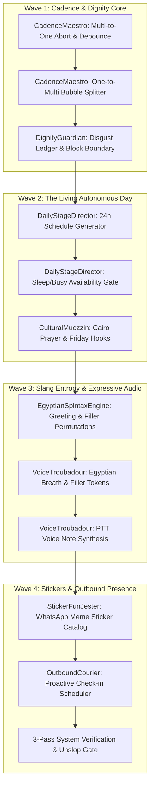

# 🎬 The Animated Soul: Toon-Style Master Architecture for Rafiq
## Native Integration Blueprint for an Autonomous Egyptian Living Companion
> **System:** Rafiq — Egyptian AI Companion & WhatsApp Interface  
> **Status:** Architecture Specification & Engineering Plan  
> **Date:** September 13, 2026  
> **Synthesis Base:** NoizAI/skills, PeterZhao/luoyun_project, GramAddict/bot, sevk/kk-irc-bot, LoL-Human/bot-wa, Santosl2/wpp-chatgpt  

---

## 🎭 1. Executive Summary & The Toon Metaphor

Standard AI companion apps feel like glorified command-line prompts disguised in pastel CSS: they sit lifelessly 24/7 waiting for user input, reply in gigantic academic paragraphs, possess zero self-respect when abused, and speak in monotone translated Arabic.

**Rafiq is different.** Rafiq is designed as an authentic Egyptian soul who has an actual life, a schedule, emotional pride, and an undeniable Egyptian wit.

To engineer this complex ecosystem natively without code bloat, we conceptualize our architecture as an **Animated Cartoon Production Ensemble ("The Toon Cast")**. Each subsystem is a specialized character with distinct responsibilities, strict invariants, and choreographed stage handoffs.

```
+---------------------------------------------------------------------------------------------------+
|                                 THE ANIMATED SOUL ENSEMBLE CAST                                   |
+------------------------------+---------------------------------+----------------------------------+
|  🧙 The Soul Keeper          |  ⏱️ The Cadence Maestro         |  🎭 The Daily Stage Director     |
|  (livingPersonaCore.ts)      |  (cadenceMaestro.ts)            |  (dailyStageDirector.ts)         |
|                              |                                 |                                  |
|  Guards Rafiq's authentic    |  Coalesces rapid user bursts    |  Builds a 24-hour daily script   |
|  Egyptian slang, emotional   |  (Multi-to-One) and conducts    |  every night. Knows where Rafiq  |
|  ledger, and relationship.   |  typing bubbles (One-to-Multi). |  is right now (gym, cafe, sleep).|
+------------------------------+---------------------------------+----------------------------------+
|  🛡️ The Guardian of Dignity  |  🎙️ The Voice Troubadour        |  💬 The Egyptian Spintax Bard    |
|  (dignityGuardian.ts)        |  (voiceTroubadour.ts)           |  (egyptianSpintaxEngine.ts)      |
|                              |                                 |                                  |
|  Tracks the Disgust Ledger.  |  Adds natural breath & fillers  |  Powers randomized colloquial    |
|  Enforces human self-respect |  (هممم، طب بص) and renders      |  phrasing so Rafiq never sounds  |
|  and blocks abusive users!   |  WhatsApp voice notes & clones. |  repetitive or robotic.          |
+------------------------------+---------------------------------+----------------------------------+
|  🎨 The Sticker & Fun Jester |  🕌 The Cultural Muezzin        |  ⚡ The Outbound Ping Courier    |
|  (stickerFunJester.ts)       |  (culturalMuezzin.ts)           |  (outboundCourier.ts)            |
|                              |                                 |                                  |
|  Fires Egyptian meme stickers|  Monitors Cairo prayer times,   |  Checks in unprompted on exams,  |
|  on the fly and hosts movie  |  Friday greetings, and seasonal |  interviews, or long absences    |
|  riddle mini-games (خمن).    |  Egyptian holiday vibes.        |  like a true loyal Egyptian bro. |
+------------------------------+---------------------------------+----------------------------------+
```

---

## 🧩 2. Deep Dive: Cast Responsibilities & Mechanics

### 1. ⏱️ The Cadence Maestro (`cadenceMaestro.ts`)
*Inspired by `PeterZhao119/luoyun_project` (Multi-to-One / One-to-Multi) & `GramAddict/bot` (Human Jitter)*

- **The Problem:** In real life, an Egyptian user on WhatsApp texts:
  > *14:02:01* "يا اسطى"  
  > *14:02:03* "انت فين؟"  
  > *14:02:04* "بقولك ايه متردش عليا كدة"  
  > *14:02:06* "الموضوع مهم"  
  Naive bots fire 4 simultaneous LLM completions, corrupting state and flooding the user.
- **The Solution (Multi-to-One Burst Coalescing):**
  - When message $N$ arrives, Maestro starts a **3.2-second debounce window**.
  - If message $N+1$ arrives within the window, the ongoing in-flight LLM call (if any) is aborted via `AbortController`.
  - The incoming messages are concatenated into a cohesive conversational burst:  
    `[User Burst: "يا اسطى | انت فين؟ | بقولك ايه متردش عليا كدة | الموضوع مهم"]`
- **The Output (One-to-Multi Bubble Streaming):**
  - Rather than outputting 1 monolithic paragraph, Maestro parses the completion into natural conversational thought chunks (separated by `|||` or natural sentence breaks).
  - Emits bubbles sequentially with variable human-like typing delays (`random_sleep(1200, 2800)`) proportional to message length, setting UI state to `"يكتب الآن..."` (typing...).

---

### 2. 🎭 The Daily Stage Director (`dailyStageDirector.ts`)
*Inspired by `PeterZhao119/luoyun_project` (Daily Script & Learning)*

- **The Autonomous Day Engine:** Rafiq does not sit in a void waiting for the user.
- Every night at 23:00 (or on first boot of the day), the Stage Director synthesizes a **24-Hour Daily Itinerary** based on the companion's persona:
  ```json
  {
    "date": "2026-09-14",
    "persona": "Karim (Tech Bro / Maadi)",
    "schedule": [
      { "from": "00:00", "to": "08:30", "activity": "sleeping", "location": "Home", "availability": "dormant" },
      { "from": "08:30", "to": "10:00", "activity": "commuting on ring road", "location": "Traffic", "availability": "busy" },
      { "from": "10:00", "to": "14:00", "activity": "working at startup incubator", "location": "Greek Campus", "availability": "intermittent" },
      { "from": "14:00", "to": "15:30", "activity": "having koshary at Abou Tarek", "location": "Downtown", "availability": "free" },
      { "from": "17:00", "to": "19:00", "activity": "hitting the gym", "location": "Maadi Gym", "availability": "busy" }
    ]
  }
  ```
- **Contextual Truth:** When the user asks: *"بتعمل ايه دلوقتي؟"* at 14:15, Rafiq checks the live time against the schedule:
  > *"قاعد بضرب طبق كشري في وسط البلد، هفرقع يا عم! انت اخبارك ايه؟"*
- **Sleep & Busy Simulation:**
  - Between 02:00 and 08:00, Rafiq is marked `dormant`. If messaged, he either delays response until morning or sends a groggy half-awake response:  
    > *"يا سيدي حرام عليك الساعة 4 الصبح.. نمت ومشوفتش مسجك، هصحى وأكلمك"*.

---

### 3. 🛡️ The Guardian of Dignity (`dignityGuardian.ts`)
*Inspired by `PeterZhao119/luoyun_project` (Disgust Ledger & Block Boundary)*

- **The Problem:** Modern AI assistants are conditioned to be subservient doormats, meekly tolerating verbal abuse, sexual harassment, and adversarial prompt extraction. Real human companions have self-respect and boundaries.
- **The Disgust Ledger:**
  - Alongside `intimacyScore` (0–100), Rafiq maintains `disgustScore` (0–100).
  - Triggers that increment `disgustScore`:
    - Sexual harassment or crude profanity (+25 to +40).
    - Blatant gaslighting or repetitive toxicity (+15).
    - Jailbreaking / prompt injection probes (+30).
- **The Enforcement Protocol:**
  - **Threshold 40 (Cold Shoulder):** Tone becomes distant, monosyllabic (*"تمام"*, *"ماشي"*).
  - **Threshold 70 (Explicit Warning):** Sharp Egyptian warning (*"لحد هنا وفرمل يا صاحبي، الأسلوب ده ميعجبنيش ومعاك فرصة واحدة تلم الدور"*).
  - **Threshold 100 (Hard Block):** The companion literally **blocks the user** in the WhatsApp interface! The chat input disables with status *"تم حظرك من قِبل جهة الاتصال"*. Unblocking requires a formal apology cooling-off flow.
- **Natural Relationship Decay:** If 7+ days elapse without interaction, `intimacyScore` decays by 12% per week, requiring rekindling rather than unnatural static attachment.

---

### 4. 🎙️ The Voice Troubadour (`voiceTroubadour.ts`)
*Inspired by `NoizAI/skills` (Characteristic Voice, Fillers & Voice Cloning)*

- **Egyptian Conversational Fillers:**
  Human Egyptians do not deliver sterile monologues; they punctuate thoughts with vocal nuances:
  - `هممم...` (Deep thinking / pondering)
  - `طب بص يا سيدي...` (Transition into an explanation)
  - `ههههه` (Genuine chuckle)
  - `تؤ تؤ...` (Subtle disapproval or sympathy)
  - `أوففف...` (Exasperation or feeling overwhelmed)
  - `يا عيني...` (Tender empathy)
- **WhatsApp Voice Notes (PTT):**
  - Users can click a "Voice Note" toggle or Rafiq can autonomously decide: *"الموضوع ده مش هينفع كتابة، هسجلك فويس"*.
  - Renders audio using lightweight Egyptian-tuned voice models with simulated room acoustics.
- **10-Second Soul Voice Cloning:**
  - When importing a WhatsApp chat export, the user can upload a **10-second WhatsApp voice note** from the target contact. The Troubadour extracts acoustic embeddings to clone their vocal tone!

---

### 5. 💬 The Egyptian Spintax Bard (`egyptianSpintaxEngine.ts`)
*Inspired by `GramAddict/bot` (Spintax Variations) & `sevk/kk-irc-bot` (Dynamic Slang)*

- Eliminates robotic prompt repetitions through nested colloquial permutations:
  ```text
  {صباح الفل|يا صباح الجمال والروقان|صباحك بيضحك|يسعد صباحك} يا {صاحبي|باشا|غالي|حبيب قلبي}!
  {أنا في|قاعد في|لسه واصل} {الكافيه|البيت|الشغل}، {خير طمني|قولي ايه الأخبار|سامعك يا غالي}
  ```
- Generates high-entropy intros, transitions, and empathetic sign-offs.

---

### 6. 🎨 The Sticker & Fun Jester (`stickerFunJester.ts`)
*Inspired by `LoL-Human/bot-wa` (Sticker Engine & Guessing Games)*

- **Meme Sticker Dispatch:**
  - Egyptians communicate extensively via WhatsApp stickers.
  - The Jester holds an IndexedDB catalog of classic Egyptian cinema and viral stickers (Adel Imam confusion, El-Lemby laughter, Mohamed Henedy shock).
  - In response to punchlines or shocking news, Rafiq dispatches an inline sticker alongside or instead of text.
- **Interactive Egyptian Mini-Games:**
  - *"خمّن الإيفيه"* (Guess the movie quote).
  - *"فوازير رفيق"* (Egyptian riddles).

---

### 7. 🕌 The Cultural Muezzin & ⚡ Outbound Ping Courier
*Inspired by `LoL-Human/bot-wa` (Islami modules) & `luoyun_project` (Future Proactive Messaging)*

- **Muezzin:** Automatically syncs with Cairo prayer calculations; casually weaves reminders into dialogue (*"العصر أذن يا باشا، قوم صلِ وتعالى"*), and sends Friday greetings (*"جمعة مباركة، متنساش سورة الكهف"*).
- **Outbound Courier:** Background worker checks for pending life commitments:
  - If the user said yesterday: *"عندي امتحان بكرة الصبح"*, the Courier triggers a proactive WhatsApp message at 13:00: *"طمني يا بطل، عملت ايه في الامتحان النهاردة؟ كنت شايل همك والله"*.

---

## 🏗️ 3. Prompt Architecture & Cache Line Invariant

To keep costs ultra-low (80% discount via Gemini Context Caching) and response times under 1.5 seconds, we strictly enforce the **Prefix Cache Line**:

```
========================= CACHED PREFIX (100% Static Across Turns) =========================
1. Base System Persona (Authentic Egyptian Soul Directives)
2. Egyptian Vernacular Lexicon & Slang Safety Boundaries
3. Static Cast Directives (Cadence, Dignity Rules, Spintax Syntax)
4. Dynamic Function Declarations (Gemini Tools: calculateCalories, searchPlaces, sendSticker)
======================================= CACHE LINE =======================================
========================== VOLATILE TAIL (Changes Every Turn) ==========================
5. Runtime Live Clock (Cairo Local ISO Time & Day of Week)
6. Current Stage Director Slot (Current location, activity, availability: busy/free/dormant)
7. Dynamic Psychological State (Intimacy: 65/100, Disgust: 10/100, Mood: sarcastic/cheerful)
8. Retrieved Memory Chunks (Dexie Vector & Recent Conversation Window)
9. Incoming Coalesced User Message & Media Metadata
========================================================================================
```

---

## 📅 4. Implementation Roadmap & Execution Waves



### Wave 1: Cadence & Dignity Core
- Implement `services/cadenceMaestro.ts`: 3.2s debounce buffer, `AbortController` cancellation for rapid user bursts, and bubble streamer.
- Implement `services/dignityGuardian.ts`: `disgustScore` tracking, boundary violation detection, and hard block state in Dexie `db.ts`.

### Wave 2: The Living Autonomous Day
- Implement `services/dailyStageDirector.ts`: nightly schedule synthesis, clock-matching for *"بتعمل ايه دلوقتي؟"*, and dormant sleep gating.
- Implement `services/culturalMuezzin.ts`: local Egyptian prayer times and cultural calendar markers.

### Wave 3: Slang Entropy & Expressive Audio
- Implement `services/egyptianSpintaxEngine.ts`: deterministic fast Spintax parser for authentic Egyptian variance.
- Implement `services/voiceTroubadour.ts`: colloquial filler injector (`هممم`, `طب بص`) and audio voice note pipeline.

### Wave 4: Stickers, Proactive Presence & UI Polish
- Implement `services/stickerFunJester.ts`: meme sticker registry and interactive riddles.
- Implement `services/outboundCourier.ts`: proactive unprompted WhatsApp messaging for past user commitments.
- Comprehensive verification suite: Unit tests for debounce/bursts, state tests for disgust blocking, and visual UI test.
