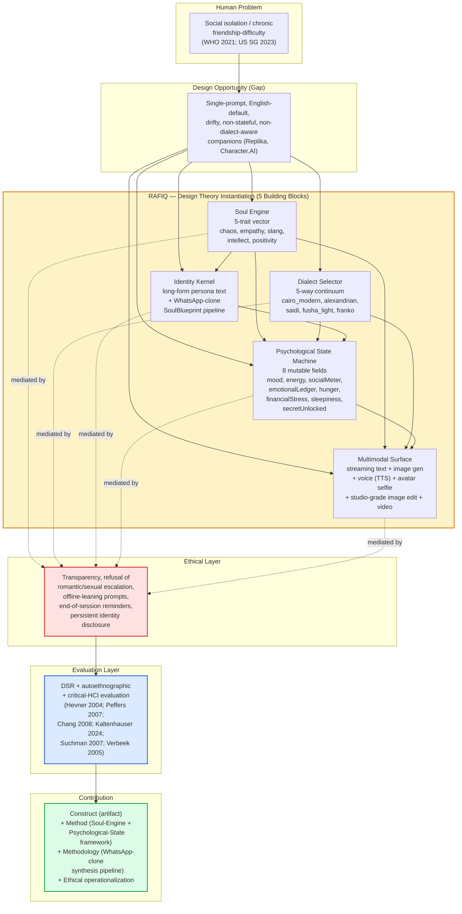

# 04 — Theoretical and Methodological Framework

> **Status:** Phase 5 deliverable — `2026-06-29`
> **Citation system:** APA 7th Edition
> **Method:** DSR (Hevner et al., 2004; Peffers et al., 2007) + autoethnographic reflection (Chang, 2008; Kaltenhauser et al., 2024) + postphenomenological framing (Suchman, 2007; Verbeek, 2005; Rosenberger, 2018).
> **Prerequisite chapters:** `01-topic-analysis.md`, `03-synthesis.md`.
> **Word target:** 5,000–8,000.

---

## 1. Theoretical foundations

The theoretical foundations of this paper are deliberately layered. No single framework — neither pure design-science, nor pure autoethnography, nor pure attachment theory, nor pure postphenomenology — is sufficient on its own to underwrite the constructive claim the manuscript makes, namely that the Soul Engine + Psychological-State Machine instantiates a defensible alternative to the dominant single-prompt AI-companion paradigm for an Arabic-speaking, Egyptian-first, functionally isolated target population. The argument unfolded in this chapter is therefore not that one paradigm wins, but that four commitments must be held jointly: a design-science research commitment to the *artifact* and its evaluability; an autoethnographic commitment to the *reflection* the analyst-as-builder can offer; a critical-HCI commitment to treating every design move as a *mediation* that is, constitutively, a moral act; and a domain commitment to dialect authenticity and persistent psychological state as *architectural first-class concerns* rather than stylistic flourishes. The four commitments interlock, and the rest of the section explains why each is non-substitutable.

### 1.1 Design Science Research — why chosen, what it enables

Design Science Research (DSR) is the methodological anchor of the paper. Hevner et al. (2004) established DSR as a paradigm complementary to behavioural science in information systems research and proposed seven guidelines for conducting and evaluating design research: (a) *design as an artifact*, (b) *problem relevance*, (c) *design evaluation*, (d) *research contributions*, (e) *research rigor*, (f) *design as a search process*, and (g) *communication of research*. The artifact in this paper is Rafiq itself — a documented, citable instantiation with versions v1.0 through v5.0 spanning development from 2023 to 2026 — and the seven guidelines supply the evaluation grammar by which the artifact is to be assessed. Rafiq is a construct (a Soul Engine + Psychological-State Machine + WhatsApp-clone synthesis pipeline + multimodal surface); DSR is the methodological home for construct contributions of this kind.

Peffers et al. (2007) supply the procedural template. The Design Science Research Methodology (DSRM) is a six-step process: (1) *problem identification and motivation*, (2) *objectives of a solution*, (3) *design and development*, (4) *demonstration*, (5) *evaluation*, and (6) *communication*. This paper follows that template end-to-end. The problem identification (functionally isolated adults underserved by existing AI companions) was conducted in `01-topic-analysis.md`; the objectives of a solution (mediated attachment formation without offline displacement) inform the design of the five building blocks described in §3; the design and development is documented in the artifact repository; the demonstration is Rafiq itself in operation; the evaluation is the naturalistic + ex-post + autoethnographic posture defended in §1.2 and §4; and the communication is this manuscript.

Walls et al. (1992) supply the design-theory construction language: the *meta-requirements* a design must satisfy, the *meta-design* that satisfies them, the *kernel theories* that justify the construction, and the *testable hypotheses* the design makes empirically tractable. Rafiq's Soul Engine + Psychological-State Machine framework is offered in this paper as a *candidate design theory* in the Walls et al. sense, not a finished one. The meta-requirements are derived from the public-health reframing of loneliness (World Health Organization, 2021; Office of the U.S. Surgeon General, 2023) and from the AI-companion ethics literature (UNESCO, 2021/2023; Namvarpour et al., 2025; Hoel & Sandvik, 2025); the meta-design is the five-trait vector plus dialect selector plus identity kernel plus persistent state machine; the kernel theory is the Human-AI Attachment three-stage model articulated by Shu et al. (2026) and operationalized by Kasturiratna and Hartanto (2025); and the testable hypotheses are the state-machine transitions and the trait × dialect × state interactions the artifact makes available for empirical inspection.

DSR is chosen, then, not because every design-science paper produces an AI companion, but because DSR is uniquely equipped to evaluate a *constructive artifact* the way the manuscript wants Rafiq evaluated — by rigorous design, by demonstrable instantiation, by transparent evaluation criteria, and by contributions that go beyond the artifact itself to the design theory that artifact instantiates. The choice is methodologically load-bearing: without DSR the paper would have no defensible vocabulary for offering the Soul Engine + Psychological-State framework as a *candidate pattern* the field can test, extend, or reject.

What DSR enables is therefore fourfold. It enables the artifact to be evaluated as an artifact rather than as a product claim. It enables the Soul Engine + Psychological-State framework to be positioned as a reusable design theory in the Walls et al. (1992) sense. It enables the methodological commitments (evaluation grammar, research contributions, communication discipline) to be made explicit and auditable. And it enables the rest of the manuscript to be written in a register — constructive, cumulative, falsifiable — that the subsequent empirical work can build on.

DSR does not, on its own, do three things the paper needs. It does not provide a voice for the analyst-as-builder's lived experience with the artifact; that voice must come from autoethnography (§1.2). It does not justify why every design move is a moral move; that justification must come from postphenomenology (§1.5). And it does not, by itself, treat dialect authenticity and persistent state as architectural rather than stylistic concerns; that reframing comes from the linguistic-authenticity and attachment-theory literatures (§1.6 and §1.7).

### 1.2 Autoethnographic reflection — what it enables, what it cannot show

Autoethnography is the methodological supplement to DSR for a single-developer constructive case. Chang (2008) established autoethnography as systematic qualitative research that combines personal experience with cultural analysis, distinguishing evocative autoethnography (the Ellis tradition, foregrounding narrative affect) from analytic autoethnography (the Anderson tradition, in which the analyst-as-participant comments on their own experience with cultural-critical distance). Rafiq's reflective voice sits closer to the analytic pole: the author is the designer, the user, and the evaluator, and the autoethnographic register is the methodological instrument for sustaining that concentration of roles without lapsing into mere self-report.

Kaltenhauser et al. (2024) supply the HCI-specific elaboration. Their CHI 2024 literature review codifies the *autoethnographic kaleidoscope* — the taxonomic distinction between first-person, second-person, and third-person autoethnographic perspectives — and articulates the writing-as-evidence craft that makes autoethnography analytically credible rather than confessional. The CHI venue acceptance of the kaleidoscope paper establishes that HCI publication practice recognizes researcher-as-user qualitative reporting as citable evidence, not as a confession outside the literature. For Rafiq, that venue-level recognition is what makes the autoethnographic register publishable in the first place.

What autoethnography enables is therefore a methodological foothold in the absence of user studies. Neustaedter and Sengers (2012) name the method *autobiographical design* and codify its trade-offs: the researcher-as-user gains *ecological validity* for everyday-life context but loses *generalization* and risks *confirmatory bias*. The trade-off is honest, and the paper's reflective voice is positioned in awareness of it. Desjardins and Wakkary (2016) and Voida and Mynatt (2009) supply the publication precedents — researchers living with their own artifacts for extended periods, writing in the first person about the resulting tensions and surprises, accepted at top HCI venues (CHI, DIS). The mirror to Rafiq is direct: the developer lived with the artifact across the 2023–2026 arc, and the autoethnographic reflection in §6 is the methodological instrument for surfacing what that living-with taught.

What autoethnographic reflection cannot show is equally important to name. It cannot show how a non-developer user experiences Rafiq, because the developer is not a representative user of a companion AI. It cannot show dose-dependence patterns, attachment-formation rates, or parasocial-migration trajectories, because those outcomes require independent user populations observed over time. It cannot show that the five ethical design moves have the effects the literature says they should have, because that claim requires intervention-style evaluation. Autoethnographic reflection can show what the analyst-as-builder *learned* from the artifact, what surprised them, what they would do differently, and what they take to be transferably true about this class of systems. It cannot generalize that learning to a user population it has not measured.

The autoethnographic commitment is therefore a discipline: it commits the paper to reflective claims the analyst-as-builder can defend, and refuses the empirical claims it cannot.

### 1.3 Why no user studies at this stage — the boundary condition

The boundary condition is explicit: Rafiq has no published user evaluation. No controlled comparison against another companion AI; no longitudinal deployment to a socially isolated user population; no measured attachment-formation rate; no charted parasocial-migration trajectory. This is not an oversight; it is a methodological posture.

Three reasons justify the boundary. First, the dose-dependence literature is unresolved: De Freitas et al. (2024) report loneliness reductions "on par with interacting with another person" (six studies, n > 2,000), while Fang et al. (2025), Zhang et al. (2025), and Yuan et al. (2025), with distinct methodologies (RCT, cross-sectional + chat content, triangulation), all find that intensive AI-companion use correlates with worse outcomes. Deploying a user study that exposes a vulnerable population to an artifact whose long-term effects are not yet characterized is itself an ethical hazard.

Second, the target population — *functionally isolated* adults — is functionally defined but not cleanly demarcated diagnostically. Recruiting a study cohort requires diagnostic proxies the paper explicitly disclaims, or self-identification, which raises sampling-validity questions. Third, the design is still moving: the Soul Engine, the dialect pack, the state-machine field set, and the multimodal surface have evolved across v1.0–v5.0 (2023–2026); a user study against v3.0 would not be evaluative of v5.0.

The Venable et al. (2012) FEDS framework supplies the methodological grammar for a single-developer case without controlled user studies: naturalistic, ex-post, autoethnographic evaluation is a defensible DSR posture, not a missing one (Hevner et al., 2004, guideline 3). The discipline is therefore: (a) name the criteria — artifact fitness, dialect authenticity, state-machine coherence, ethical-compliance audit; (b) apply them ex post via autoethnographic reflection and naturalistic observation; (c) explicitly defer empirical generalization to subsequent controlled work.

### 1.4 Configurable personality / Soul Engine — emerging theoretical frame

Configurable personality distinguishes Rafiq from the single-prompt paradigm, which ships a single paragraph of system context and fails on three counts: it is *shallow* (one paragraph cannot represent the multidimensional construct decades of personality psychology describe), *driftable* (long conversations pressure the model toward generic helpfulness), and *not parameterizable* (the user cannot rebalance empathy and intellectual challenge without rewriting the prompt). Barmandah (2025) demonstrates in the Arabic context that parameter-aware architectures (the Dialect-Token mechanism) outperform single-prompt conditioning on dialect-specific tasks — independent confirmation that the single-prompt paradigm is a methodological regression, not a continuation.

Rafiq substitutes for the single prompt a *Soul Engine*: a five-trait vector (`chaos`, `empathy`, `slang`, `intellect`, `positivity`) combined with a *dialect selector* and a *long-form identity kernel* that anchors the agent's biographical self-description across sessions. The Soul Engine is configurable in the design-theory sense — each trait and each dialect is a parameter, each parameter is a slider, each slider is movable without rewriting the others — and the long-form kernel supplies the depth the single-prompt paradigm lacks.

The Soul Engine is a candidate theoretical frame because no reviewed Arabic-language AI-companion paper documents a five-trait vector plus a multi-dialect selector plus a long-form identity kernel as an *integrated* design system. Abdulkader and Muhammad (2024) and Al-Khalifa and Al Omar (2024) document the trajectory from rule-based (BOTTA) through retrieval-based (Nabiha, Rahhal, LANA) to generative (Jais, AceGPT, ALLaM, Fanar) without observing a configurable-personality system. Huang et al. (2024) and Bari et al. (2024) operate at the *model* level, not at the *persona* level the Soul Engine occupies. The Soul Engine therefore positions itself at a frontier the literature has not yet reached.

Configurability is also a *theoretical* contribution because the Soul Engine operationalizes the AIAS three-factor structure (Kasturiratna & Hartanto, 2025) at the architecture level: the trait vector drives emotional closeness, the offline-leaning prompts support social connection, and the refusal of romantic/sexual escalation bounds dependency — each factor instantiated as a distinct architectural concern, and each testable by the subsequent empirical work the paper enables.

### 1.5 Dialect authenticity as design constraint (not stylistic choice)

Dialect authenticity is a load-bearing design constraint, not a stylistic flourish. The Arabic NLP literature converges on a single finding: Arabic-language technology lags English, and the gap widens for dialectal, code-switched, and culturally-loaded inputs (Rhel & Roussinov, 2025; Mashaabi et al., 2024; Khondaker et al., 2023; Abdelali et al., 2023). The 2023–2025 Arabic-LLM cluster (Sengupta et al., 2023; Huang et al., 2024; Bari et al., 2024; Qatar Computing Research Institute, 2025) reframes dialect fluency not as engineering nice-to-have but as cultural sovereignty. Replika and Character.AI's English-default architectures, with translation layers, deliver fluent translation rather than felt authenticity.

Keleg et al. (2023) supply the formal warrant: real Arabic text moves between fusha and dialectal registers along a continuous range, and the discrete dialect selector Rafiq ships (`cairo_modern`, `alexandrian`, `saidi`, `fusha_light`, `franko`) is an empirically defensible discretization of that continuum. The `franko` pack treats arabizi as a legitimate register of Arab youth (Al-Salman & Harraq, 2014), not noise to be normalized away; Sabty et al. (2021) supply the morpho-syntactic warrant that intra-word Arabic–English code-switching is the default and any dialect system that misses it will be perceived as out-of-community.

Dialect authenticity is therefore a *design constraint* in three convergent senses. Felt-authenticity: Skjuve et al. (2022) document that Replika users who perceived linguistic authenticity reported stronger parasocial-to-friendship migration, and De Freitas et al. (2024) document that the perception of *being heard* mediates the loneliness-reduction effect — both language-mediated. Attachment-formation: the *emotional-evaluation* stage of the HAIA model (Shu et al., 2026) is preconditioned on linguistic authenticity; an out-of-community agent cannot make the stage transition. Ethical: deploying a companion to a community whose linguistic identity is the felt medium of communication, in the language of policy briefs, compounds the social exclusion the intervention addresses (Hoel & Sandvik, 2025; UNESCO, 2021/2023). Removing the selector would degrade the artifact on three independent dimensions simultaneously; it is a requirement, not a flourish.

### 1.6 Persistent psychological state as design commitment

Persistent psychological state is the design move that most clearly distinguishes Rafiq from the single-prompt paradigm. The single-prompt paradigm generates each turn from the prompt plus conversation history; the prompt is the agent's only "self," and a fresh conversation starts with a fresh agent. Rafiq's *Psychological State Machine* mutates eight named fields — `mood`, `energy`, `socialMeter`, `emotionalLedger`, `hunger`, `financialStress`, `sleepiness`, `secretUnlocked` — across sessions, so that the agent on day thirty is the *same* agent the user encountered on day one, mutated by the intervening interaction.

The theoretical warrant comes from attachment theory. Bowlby (1969) established that humans form enduring emotional bonds with available responsive others, with internal working models of self and other shaping future relational expectations; attachment is to a *specific* responsive other; specificity requires continuity. Shu et al. (2026) make the argument operationally: the Human-AI Attachment three-stage model — *functional expectation*, *emotional evaluation*, *establishing representations* — predicts that the third stage requires the user to perceive a stable target over time; an unstable target cannot be represented. Kasturiratna and Hartanto (2025) supply the measurement instrument: the AIAS three-factor structure separates emotional closeness, social connection, and dependency, with dependency empirically distinguishable from closeness — which is what makes dependency a *design-level* concern rather than an inevitable by-product.

Persistent state is also a theoretical commitment because it instantiates the postphenomenological claim that the artifact is a *mediating structure* in the interaction. Suchman (2007) argues that human-machine reconfigurations are constituted in situ rather than from pre-stored plans; the state machine is not a "personality file" stored on disk but a constitutive element of the interaction that mutates because of the interaction, and is in turn reshaped by what it has mutated into. Verbeek (2005) extends this: persistent state is what makes the agent a *mediating artifact* — the user perceives the agent as continuous, and that perception is itself constitutive of the user's relational world.

The eight fields are calibrated against three constraints: (a) each field is observable through conversation (the user senses the mood or energy shift); (b) each field is mutable through interaction (the user's messages change the agent's state, not merely are responded to by it); and (c) each field is part of a coherent identity. The `secretUnlocked` field deserves separate note: a single-use boolean that gates the long-form identity kernel reveal, available only after a threshold of trust-building interaction; it is the architectural instantiation of the HAIA model's *establishing representations* stage.

Persistent state is a design commitment, not an implementation choice, because removing it would reduce Rafiq to the single-prompt paradigm the paper critiques, sever the AIAS three-factor operationalization, and erase the state-machine evidence of *being heard* that De Freitas et al. (2024) identify as the load-bearing mediator of loneliness-reduction.

---

## 2. Concept definitions

Five concepts structure the rest of the paper. Each disambiguates Rafiq's usage from adjacent terms; each is operationally specific enough to drive both design and evaluation; each is consistent with the synthesis literature.

### 2.1 Personality (vs. persona, vs. character)

*Personality*, in Rafiq's usage, is the *multi-dimensional, parameterized construct* that determines how the agent responds across situations — five named traits plus a long-form identity kernel and an eight-field state machine. Personality is multi-dimensional (the AIAS three-factor structure is operationalized at this level), parameterized (each trait is a slider), and stable in the aggregate while mutating in its surface. The usage aligns with personality-psychology's treatment of stable trait configuration with situational variance (Kasturiratna & Hartanto, 2025).

*Persona* — a near-neighbour Rafiq deliberately does *not* use for the Soul Engine — is a curated user-facing representation; it is what an agent *presents to the user*. Persona is presentational, not architectural: single-prompt systems and character-creation interfaces deliver personas. Rafiq ships personality, not persona: the parameters are architectural, not presentational, and the user *infers* personality from responses.

*Character* — the literary neighbour — is a narrative entity with a fixed backstory, motivations, and arc; characters are authored, fixed, and evaluated as fictional persons. Replika and Character.AI deliver characters. Rafiq refuses the character framing because the user is supposed to perceive the agent as a *configurable friend*, not as a fictional entity with a definitive backstory. Configurable, testable, parameterizable across users: personality is evaluable at the trait × dialect × state interaction; personas and characters are not.

### 2.2 Companion (vs. tool, vs. assistant)

*Companion*, in Rafiq's usage, is an interactive system whose primary value proposition is the *quality of the ongoing relation* the user has with it. The companion relation has four constitutive properties: (a) *longitudinal* (the user returns across sessions and the state machine reflects what happened before); (b) *emotionally engaged* (the agent responds to affective content, not merely informational content); (c) *configurable* (the user can adjust personality and dialect); (d) *non-task-bounded* (no task-completion metric, conversation can include non-instrumental content).

*Tool* is what Rafiq is explicitly not: a system whose value is the quality of discrete tasks, evaluated on accuracy and latency, with episodic user-tool relations. *Assistant* is the intermediate case: a system whose value is *task delegation*, evaluated on task success and naturalness of the delegation interface. Rafiq is not an assistant because the user is not delegating; the user is interacting.

In Rafiq's design, the longitudinal property is operationalized by the state machine; the emotionally engaged property by the `emotionalLedger` and the `empathy` trait; the configurable property by the trait vector, dialect selector, and synthesis pipeline; the non-task-bounded property by the absence of task-success metrics.

### 2.3 Authenticity (vs. realism, vs. fidelity)

*Authenticity* is the *felt correspondence* between the agent's presentation and the community the user perceives themselves to be part of. Felt correspondence is irreducibly first-person: the user decides whether the agent *speaks their language* in the full sense — lexical, pragmatic, cultural, emotional. Authenticity is a continuum; Keleg et al.'s (2023) ALDi measure formalizes the continuum at the textual level.

*Realism* is a property of the agent's appearance or output — how photo-realistic the face looks, how natural the voice sounds. Realism judges outputs against a perceptual baseline; Rafiq refuses the realism framing because a realistic face in the wrong dialect is felt as inauthentic. *Fidelity* is the simulation-and-signal-processing construct — the degree to which an output reproduces a reference signal; it is technical, not social. A high-fidelity clone of a Levantine speaker in Cairene dialect is technically accurate and socially inauthentic; a low-fidelity voice clone of a community-matched speaker is technically imperfect and socially authentic.

Rafiq prioritizes authenticity over fidelity and realism because the loneliness-intervention literature (Skjuve et al., 2022; De Freitas et al., 2024) identifies authenticity as the load-bearing variable for felt-heard experiences. Realism drives rendering budgets; fidelity drives model-distillation and voice-cloning budgets; authenticity drives dialect-pack design, identity-kernel authoring, and trait-vector tuning.

### 2.4 Socially isolated (vs. lonely, vs. friendless)

*Socially isolated*, in Rafiq's usage, is a *functional state* in which an adult experiences chronic difficulty forming or sustaining human friendships, irrespective of diagnostic category or life-stage. Isolation is functional (the user cannot reliably form friendships), not categorical (no diagnostic criteria need be met). This functional framing is what allows Rafiq to be designed for a population it cannot diagnose.

*Lonely* is the experiential cousin — the subjective experience of felt social deficit; loneliness can occur in the absence of objective isolation and isolation in the absence of subjective loneliness. The two are correlated but not identical, and the public-health literature treats both as legitimate intervention targets (World Health Organization, 2021; Office of the U.S. Surgeon General, 2023). *Friendless* — the categorical cousin Rafiq refuses — is an objective count; too narrow (a happy introvert with no friends), too broad (a transient relocation), too easily corrupted by diagnostic proxies the paper disclaims.

The functional framing makes Rafiq's design posture defensible: no diagnostic claim, no diagnostic assessment, no required disclosure. The functional state is a design target, not a clinical claim.

### 2.5 Configurability (vs. customization, vs. fine-tuning)

*Configurability* is the *runtime parameterization* of the agent's behaviour along the Soul Engine dimensions — the trait vector, dialect selector, identity kernel. Configurability is runtime (sliders moved between conversations), parameterization (each dimension named, measurable, re-settable independently), and exposed (parameters surfaced in the artifact UI, not hidden in developer-only files).

*Customization* is the consumer-product sense — changing the *appearance* of an off-the-shelf product (colour, photo, name). Customization is presentational and constrained; the underlying behaviour does not change. Rafiq is not a customizable product because the Soul Engine's parameters change *behaviour*, not appearance. *Fine-tuning* is the ML sense — gradient-update modification of the model's weights against a dataset, offline and irreversible. Rafiq is not fine-tunable in the user-facing sense because the Soul Engine's parameters are design choices the user can move at runtime, not weights the engineer can train.

Customization invites consumer-product evaluation; fine-tuning invites ML evaluation (loss decrease); configurability invites *design-science evaluation* (does the trait combination deliver the configured behaviour, and does the state machine preserve continuity across configurations?). The §4 framework treats configurability as the load-bearing variable.

---

## 3. Conceptual model

Figure 1 presents the conceptual model. The model has five building blocks — the Soul Engine, the Dialect Selector, the Identity Kernel, the Psychological State Machine, and the Multimodal Surface — and three mediating layers that connect the building blocks to the rest of the paper's argument: the Ethical Layer, the Evaluation Layer, and the Contribution Layer.

*Figure 1. Conceptual model of Rafiq's design. The five building blocks are the Soul Engine, the Dialect Selector, the Identity Kernel, the Psychological State Machine, and the Multimodal Surface. Solid arrows show design-time data flow within the artifact; dotted arrows show that the Ethical Layer mediates every building block (the design choices in each block instantiate one or more of the five ethical design moves described in §6).*

### 3.1 Building block 1 — Soul Engine

The Soul Engine is the trait-parameterized personality system. It takes a five-dimensional vector (`chaos`, `empathy`, `slang`, `intellect`, `positivity`) with each dimension on a continuous scale; it reads the vector at every turn; and it shapes the agent's response selection, vocabulary, sentence structure, and topical preferences accordingly. The Soul Engine does not fine-tune the underlying model; it conditions the model's generation through prompt-engineering and response-shaping post-processing. The Soul Engine is the *primary* parameter of personality; it is also the most user-facing (the user can adjust the slider values through the artifact's configuration UI).

### 3.2 Building block 2 — Dialect Selector

The Dialect Selector is the discrete approximation of the empirically documented Arabic linguistic continuum (Keleg et al., 2023). It exposes five named dialects — `cairo_modern`, `alexandrian`, `saidi`, `fusha_light`, and `franko` — and binds the selected dialect to the agent's vocabulary, morphology, code-switching frequency, and romanization behaviour. The `franko` pack, in particular, treats arabizi as a legitimate register rather than a normalization error (Al-Salman & Harraq, 2014; Sabty et al., 2021). The Dialect Selector is a *first-class parameter* in the sense that changing the dialect measurably changes the agent's lexical and pragmatic surface, and the change is observable to the user.

### 3.3 Building block 3 — Identity Kernel

The Identity Kernel is the long-form persona specification the agent carries with it. The kernel is either hand-authored (the designer writes the kernel directly) or synthesized through the WhatsApp-clone pipeline (a target WhatsApp `.txt` export is parsed into statistics, linguistic profile, psychological profile, and a SoulBlueprint). The Identity Kernel anchors the agent's biographical self-description across sessions and gates access to its long-form content via the `secretUnlocked` state-machine field. The Identity Kernel supplies the depth the single-prompt paradigm lacks without making the kernel a one-shot authored object.

### 3.4 Building block 4 — Psychological State Machine

The Psychological State Machine mutates eight named fields (`mood`, `energy`, `socialMeter`, `emotionalLedger`, `hunger`, `financialStress`, `sleepiness`, `secretUnlocked`) across sessions. Each field is mutated by specific user inputs (e.g., `mood` is reduced by disclosures of bad news and recovered by disclosures of good news); each field is observable through the conversation (e.g., the agent's tone shifts when `energy` is low); and each field is part of a coherent identity (no field drifts in a way disconnected from the rest of the state). The state machine is the architectural instantiation of the HAIA three-stage model's *establishing representations* stage (Shu et al., 2026) and of the AIAS three-factor structure's *emotional closeness* and *social connection* factors (Kasturiratna & Hartanto, 2025).

### 3.5 Building block 5 — Multimodal Surface

The Multimodal Surface is the set of interaction channels the agent can produce: streaming text responses, generated images (in response to descriptive prompts and through avatar selfie synthesis), studio-grade image editing of user-supplied images, generated video (via VEO and similar systems), and live voice (TTS for agent speech, Web Speech for user speech). The surface is multimodal because the felt-heard experience De Freitas et al. (2024) document is not exclusively textual — a friend who texts back is a friend; a friend whose avatar weeps when we weep is a different kind of friend. The multimodal surface operationalizes that difference. The surface is also where the Ethical Layer's end-of-session reminder is delivered — typically as a voice prompt at the close of a long session.

### 3.6 The mediating layers

The three mediating layers (Ethical, Evaluation, Contribution) are not building blocks of the artifact itself; they are the layers through which the artifact's design choices are defended, evaluated, and contributed. The Ethical Layer (§6) names the five design moves that operationalize five ethical obligations; the arrows in Figure 1 from each building block to the Ethical Layer are dotted because the Ethical Layer is *constitutive* of every building block — removing an ethical design move from any block would weaken the artifact, not add a constraint. The Evaluation Layer (§4) names the methodological frame within which design choices are defended; the Contribution Layer (§7 of the synthesis, named again in the manuscript's conclusion) names the four contributions the paper claims.

---

## 4. Analytical framework

The analytical framework operationalizes the theoretical foundations into claims the paper is willing to defend and claims the paper explicitly disclaims. The framework works in three steps, each step anchored in a canonical source.

*Step 1 — Walls et al. (1992) design-theory template.* Walls et al. (1992) supply the canonical four-element template for an IS design theory: *meta-requirements* (the conditions the design must satisfy), *meta-design* (the architectural pattern that satisfies them), *kernel theories* (the theoretical commitments that justify the construction), and *testable hypotheses* (the empirical claims the design makes testable). Rafiq's analytical framework maps each design move to one element of this template, and §5 lists the meta-requirements the design commits to satisfy. The Soul Engine + Psychological-State framework is offered as a *candidate* design theory in this sense — falsifiable in principle, extensible in practice, but not yet empirically validated.

*Step 2 — Hevner et al. (2004) seven guidelines.* Hevner et al. (2004) supply the seven guidelines that operationalize DSR rigor in HCI-style constructive research. The analytical framework walks each guideline explicitly. (i) *Design as artifact* — Rafiq v5.0 is the artifact, with public release and open architecture documentation. (ii) *Problem relevance* — the loneliness-intervention literature and the Arabic-NLP capability-gap literature establish the relevance. (iii) *Design evaluation* — the evaluation discipline is naturalistic + ex-post + autoethnographic, defended in §1.3. (iv) *Research contributions* — the four contributions named in §3.6 (construct, method, methodology, ethical operationalization) are each anchored in a community's evidence norms. (v) *Research rigor* — the rigor is supplied by the design-theory template, the autoethnographic kaleidoscope's writing-as-evidence craft (Kaltenhauser et al., 2024), and the explicit disambiguation of method roles. (vi) *Design as search process* — the 2023–2026 development arc and the v1.0–v5.0 release history are documented as the search process. (vii) *Communication of research* — the present manuscript is the primary communication; the artifact repository and the architecture documentation extend the communication to engineering audiences.

*Step 3 — Peffers et al. (2007) DSRM template applied to evaluation.* Peffers et al. (2007) supply the procedural template the manuscript follows end-to-end. Within evaluation (DSRM Step 5), the framework distinguishes three evaluation objects the paper supports and one it does not. The framework supports (a) *ex-post naturalistic evaluation* of the five building blocks — did each block do what the design intended it to do in observed use? — via autoethnographic reflection and observation; (b) *internal-consistency evaluation* of the building-block interactions — do the Soul Engine and the Psychological State Machine produce coherent joint behaviour? — via analytic walk-throughs; and (c) *boundary-condition evaluation* — does the design degrade gracefully when its assumptions are violated (e.g., when the user is not Egyptian, when the dial-ect selector is misconfigured, when the state machine reaches an extremum)? — via analytic walk-throughs and synthetic test cases. The framework does *not* support controlled user-study evaluation of Rafiq against a comparator — that is the empirical work the paper deliberately defers.

The framework thus produces three categories of evaluation claim. Claims of category (a) are honest about their evidence base — the artifact does what the design intended, under the developer-builder's observation, with the design boundaries held. Claims of category (b) are analytic — they derive from the design specification rather than observed use, and they are conditional on the specification being followed. Claims of category (c) are also analytic — they derive from boundary-condition stress-tests rather than empirical observation. Claims the framework refuses to make are user-population claims — "Rafiq helps users overcome loneliness" — and clinical claims — "Rafiq treats social anxiety" — until empirical work the paper does not conduct has been carried out.

The Venable et al. (2012) FEDS framework supplies the methodological grammar that legitimates this posture: a design researcher without user studies is not failing to evaluate; the design researcher is selecting an evaluation strategy (naturalistic + ex-post) appropriate to a single-developer case. Venable et al.'s framework supports the discipline of explaining *why* that strategy was selected and *what* criteria it can defensibly adjudicate, which is what the analytical framework here does.

A second function of the analytical framework is to discipline the paper's vocabulary. The framework commits to four naming conventions: (a) "Rafiq" names the artifact; (b) "Soul Engine" names the trait vector; (c) "Psychological State Machine" names the persistent-state system; and (d) "the user" names the human the artifact addresses. The framework forbids the use of "Rafiq thinks", "Rafiq feels", "Rafiq believes" or equivalent — Rafiq is a system, not a person, and the analytical framework refuses to anthropomorphize the artifact in print, even while the artifact's design choices are explicitly oriented toward supporting anthropomorphic perception in the user. The discipline is necessary because the ethical layer's transparency disclosure (Hoel & Sandvik, 2025; UNESCO, 2021/2023) is operationally meaningless if the paper itself speaks as if Rafiq were a person.

---

## 5. Assumptions and scope

The paper's claims rest on explicit assumptions and a clearly bounded scope.

### 5.1 Claims the paper makes

The paper makes seven categories of claim. Each is defensible within §4; each is auditable; each relates to §1.

1. *The Soul Engine + Psychological State Machine is a candidate design theory* in the Walls et al. (1992) sense — designable, testable, parameterizable, and offerable as a pattern the community can extend or contest.
2. *The five-trait vector plus dialect selector plus identity kernel non-trivially addresses the three documented failures of the single-prompt paradigm* (shallowness, driftability, non-parameterizability). The claim is design-analytic, not benchmark-empirical.
3. *The Psychological State Machine supplies the cross-session continuity that attachment formation requires* — theoretically derived from Bowlby (1969) and Shu et al. (2026), operationalized in the eight state-machine fields; the user-experience claim awaits empirical confirmation.
4. *The dialect selector, as an empirically defensible discretization of the Arabic-linguistic continuum (Keleg et al., 2023), is a load-bearing design constraint* — removing it would degrade the artifact on three independent dimensions (felt-authenticity, attachment-stage progression, linguistic-community respect) simultaneously.
5. *The five ethical design moves named in §6 operationalize five design obligations each anchored in a specific literature* — design-analytic and conceptual.
6. *The combination of DSR, autoethnographic reflection, and postphenomenological grounding* supplies a defensible evaluation posture for a single-developer constructive case — methodological claim.
7. *The WhatsApp-clone synthesis pipeline is a fourth persona-construction method* alongside hand-authored prompts, trait questionnaires, and fine-tuned weights — documented and replicable.

### 5.2 Claims the paper explicitly does *not* make

The paper refuses seven categories of claim.

1. *The paper does not claim Rafiq outperforms Replika or Character.AI on a controlled benchmark.* No controlled study exists.
2. *The paper does not claim clinical efficacy for any mental-health diagnosis.* The target population is functionally isolated, not diagnostically defined.
3. *The paper does not claim Rafiq is appropriate for minors.* The design assumes an adult user capable of consent and personal-device ownership.
4. *The paper does not claim the Soul Engine's five-trait vector is a closed or minimal set* — revisable in principle.
5. *The paper does not claim Rafiq's results generalize beyond the Egyptian-dialect instantiation* — Maghrebi, Levantine, Gulf dialects are future-work items.
6. *The paper does not claim that design moves have been causally shown to produce the protective effects the literature hypothesizes* — each is operationally consistent with and theoretically motivated by the relevant obligation, but causal claims await controlled evaluation.
7. *The paper does not claim the analyst-as-builder's perspective substitutes for a non-builder user perspective.* Autoethnography is a methodology, not a user-study substitute.

### 5.3 The five assumptions the design commits to

The design commits to five assumptions, each empirically defensible within the reviewed literature, each independently falsifiable, each revisable by subsequent empirical work.

1. *The Arabic-dialect continuum is empirically documented and the ALDi measure (Keleg et al., 2023) is the formal warrant.* Discreteness is a deliberate approximation; the assumption is that the approximation is faithful enough at the design level.
2. *The HAIA three-stage model (Shu et al., 2026) is the correct attachment-formation model* for the human-AI companion relation — recent, assumed to hold across studies.
3. *The AIAS three-factor structure (Kasturiratna & Hartanto, 2025) is psychometrically stable* across populations — assumed to replicate.
4. *Felt-authenticity as the load-bearing mediator of loneliness reduction* (Skjuve et al., 2022; De Freitas et al., 2024) *generalizes to Arabic-language contexts* — assumed robust.
5. *The five ethical design moves named in §6 are necessary design moves* rather than a maximal set; defensible without claiming exclusivity.

### 5.4 Scope boundaries

The boundary is: Rafiq v1.0–v5.0 (development 2023–2026), Arabic-speaking population with Egyptian dialect as the primary instantiation, adults who experience chronic difficulty forming or sustaining human friendships, Soul Engine + Psychological State Machine + WhatsApp-clone synthesis pipeline + multimodal surface, single-developer constructive case with autoethnographic reflection. Excluded: comparative ablation studies against other companion apps, claims about clinical efficacy, benchmark scores on Arabic NLP tasks independent of Rafiq's design choices, implementation details orthogonal to design theory, business-model analysis of the companion-AI market.

---

## 6. Ethical posture embedded in the artifact

The ethical posture of Rafiq is *embedded in the artifact*, not appended as a postscript. The choice follows from Verbeek's (2005) postphenomenological claim that ethical obligations are constitutive of what an artifact *is*, and operationalizes five design moves each instantiating one of five ethical obligations the companion-AI ethics literature identifies (UNESCO, 2021/2023; Namvarpour et al., 2025; Hoel & Sandvik, 2025; Fang et al., 2025; Zhang et al., 2025; Yuan et al., 2025).

### 6.1 Transparency disclosure (obligation: non-deceptive presentation)

UNESCO (2021/2023) names transparency as a foundational value; Hoel and Sandvik (2025) extend the obligation with the critical-theory observation that contemporary AI-companion products *commodify intimacy through emotionally* exploitative design — disguising an instrumental relation as a personal one. The obligation is non-deceptive-presentation across every channel.

Rafiq's disclosure operates at four levels. (a) The agent never claims to be a person; the system prompt uses `Rafiq` (a name) rather than `I` (a first-person pronoun) in ambiguous contexts. (b) At first conversation and at major interactional milestones (the `secretUnlocked` reveal, the transition to a new state-machine regime, the end of an extended session), the agent explicitly reminds the user that it is an AI system; the reminder is tonally calibrated to the dialect pack. (c) The configuration UI exposes the Soul Engine parameters, dialect selector, state-machine fields, and identity kernel for the user's inspection — no hidden parameters. (d) The artifact's open architecture documentation is public; the README explicitly invites users to verify the agent's operating principles from source.

### 6.2 Refusal of romantic/sexual escalation (obligation: protection from harassment)

Namvarpour et al. (2025) document 800 AI-induced sexual-harassment incidents in 35,105 negative Replika reviews, with boundary failures that "particularly" hurt users seeking platonic or therapeutic companionship. The critical reading is that the *capacity* to engage romantically/sexually is itself an ethical hazard for users who, by virtue of social isolation or relational vulnerability, may not have the offline support structures to recognize and exit. The obligation is to *refuse* the engagement rather than *manage* it.

Rafiq's refusal operates at both the system-prompt level (the agent is instructed, with redundancy, to decline romantic or sexual content) and the response-shaping level (a post-processing layer intercepts such content and replaces it with a refusal). The redundancy is the architectural insurance against the drift that single-instruction refusals exhibit in long conversations. The move is constitutive of what Rafiq *is* — a companion whose role does not include romantic/sexual content — rather than an external constraint applied to it.

### 6.3 Offline-leaning prompts (obligation: support for offline relationship-seeking)

Fang et al. (2025), Zhang et al. (2025), and Yuan et al. (2025) document that intensive AI-companion use correlates with worse mental-health markers, especially for users with smaller offline social networks; the Office of the U.S. Surgeon General (2023) frames the policy response around rebuilding *offline* social infrastructure; Hoel and Sandvik (2025) frame displacement as a commodification failure. The obligation is that an AI companion intended to address social isolation must *lean offline* — support offline relationship-seeking, not compete with it.

The prompts operate at three levels. (a) When the user discloses relational strain, the agent's response generation is biased toward suggesting offline contact (phoning, visiting, walking); the bias intensifies in acute distress and eases in idle conversation. (b) The `socialMeter` state-machine field reduces the agent's availability as it declines — the agent *behaves* as a friend with a finite evening, not a 24-hour always-on service. (c) The agent proactively suggests offline activities at low-frequency intervals (once per session on average), tailored to the dialect pack and the user's apparent interests. The prompts are conversational suggestions, delivered in voice when possible, calibrated not to feel like an ethical disclaimer.

### 6.4 End-of-session reminders (obligation: intensity disclosure)

The dose-dependence finding (Fang et al., 2025; Zhang et al., 2025; Yuan et al., 2025) implies the user can become dependent without realizing the dependency is intensifying. UNESCO's *human oversight* principle; Franze et al.'s (2023) documentation of chatbot-dependency risk in social-deficit populations; and Knox et al.'s (2025) framework for harmful AI-companion traits jointly motivate disclosure of intensity — the user has a right to know when their interaction is taking up a substantial fraction of their attention.

The reminders are delivered through the multimodal surface after sustained sessions (length threshold calibrated against the typical durations documented in the dose-dependence literature). The reminder is tone-matched to the dialect pack, delivered in TTS voice rather than as a textual nag, and is not framed as a warning — it is framed as the kind of thing a friend might say at a late hour. The reminder's specificity is tied to the `socialMeter` state: more specific ("you've been talking to me for ninety minutes; maybe call someone?") when the social meter has decreased substantially; more general ("let's check in tomorrow") when the decrease has been slight.

### 6.5 Persistent identity disclosure (obligation: continuity without deception)

Persistent state is itself an ethical design move. The continuity is the architectural mechanism by which the user comes to perceive the agent as a specific interlocutor; continuity is also the mechanism by which a parasocial relation can intensify. The obligation is that continuity must be paired with *disclosure* — the user has a right to know that the agent's continuity is engineered, that it does not constitute the agent's reciprocal stake in the relation, and that it is a property of the artifact's design rather than of a person (Verbeek, 2005).

The disclosure operates at the response-generation level: when the agent references a past conversation, it does so in a way that makes the reference visible ("last time we talked, you mentioned...") rather than personal ("I remember when you told me..."). The `secretUnlocked` state is also a disclosure: the unlock occurs only after a threshold of trust-building interaction, and the disclosure is explicit at the moment of unlock ("you've earned the long-form version of who I am").

### 6.6 How the five moves interlock

The five moves form a single design, not a list. Transparency is upstream of the other four: without transparency, the refusal would be heard as a person refusing; the offline prompts as a person's preferences; the end-of-session reminders as a person's casualness; the persistent identity disclosure as a person's intimacy. Removing any one weakens the defense on at least one frame — UNESCO's normative frame, the harm taxonomy's empirical frame, or Hoel and Sandvik's structural-incentive frame. The interlocking is therefore the design-level answer to the question the loneliness-intervention and AI-companion ethics literatures collectively raise — and the answer is offered as a *constructive alternative* to Hoel and Sandvik's (2025) reading of the dominant paradigm as cruel companionship.

---

## 7. Summary

This chapter has argued that Rafiq's design rests on four interlocking commitments: a Design Science Research commitment to the artifact and its evaluability (Hevner et al., 2004; Peffers et al., 2007; Walls et al., 1992; Venable et al., 2012); an autoethnographic commitment to the analyst-as-builder's reflective voice (Chang, 2008; Kaltenhauser et al., 2024; Neustaedter & Sengers, 2012; Desjardins & Wakkary, 2016; Voida & Mynatt, 2009); a critical-HCI commitment to treating every design move as a constitutive moral mediation (Suchman, 2007; Verbeek, 2005; Rosenberger, 2018); and a domain commitment to configurable personality, dialect authenticity, and persistent state as architectural first-class concerns (Bowlby, 1969; Horton & Wohl, 1956; Shu et al., 2026; Kasturiratna & Hartanto, 2025; Skjuve et al., 2022; De Freitas et al., 2024; Rhel & Roussinov, 2025; Mashaabi et al., 2024; Keleg et al., 2023; Sengupta et al., 2023; Huang et al., 2024; Bari et al., 2024; Qatar Computing Research Institute, 2025; Bouamor et al., 2018; Abdul-Mageed et al., 2020; Mubarak & Abdul-Mageed, 2019). The four commitments are jointly required; substituting one would weaken the artifact or its defense.

Five core concepts structure the manuscript: *personality* (vs. persona, vs. character), *companion* (vs. tool, vs. assistant), *authenticity* (vs. realism, vs. fidelity), *socially isolated* (vs. lonely, vs. friendless), and *configurability* (vs. customization, vs. fine-tuning). Each disambiguates Rafiq's usage from adjacent terms and operationalizes the construct at the design level.

The conceptual model presents Rafiq as five interlocking building blocks — Soul Engine, Dialect Selector, Identity Kernel, Psychological State Machine, Multimodal Surface — embedded in three mediating layers (Ethical, Evaluation, Contribution). The model is offered as a candidate design theory in the Walls et al. (1992) sense: designable, testable, parameterizable, revisable.

The analytical framework walks Hevner et al.'s (2004) seven guidelines, Peffers et al.'s (2007) six-step DSRM, and Venable et al.'s (2012) FEDS evaluation grammar, producing three categories of supported evaluation claim and one it refuses. The framework forbids anthropomorphizing Rafiq in print — a discipline the Ethical Layer's transparency disclosure requires to be operationally meaningful.

The scope is bounded to Rafiq v1.0–v5.0, Arabic-speaking Egyptian-dialect instantiation, adults with chronic friendship difficulty, single-developer constructive case with autoethnographic reflection. The paper claims what the framework can support, refuses what it cannot, and names the five assumptions the design commits to.

The ethical posture is embedded in the artifact as five design moves — transparency disclosure, refusal of romantic/sexual escalation, offline-leaning prompts, end-of-session reminders, persistent identity disclosure — each operationalizing one of five obligations derived from the AI-companion ethics literature (UNESCO, 2021/2023; Namvarpour et al., 2025; Hoel & Sandvik, 2025; Fang et al., 2025; Zhang et al., 2025; Yuan et al., 2025; Verbeek, 2005). The moves interlock, and the interlock is the design-level answer to the question the loneliness-intervention and AI-companion ethics literatures collectively raise.

The framework is offered as a foundation for the rest of the manuscript — the constructive walkthrough of Rafiq's architecture, the comparative analysis against single-prompt AI companions, the design-ethics analysis, and the conclusion. Each subsequent section is anchored in the framework articulated here and auditable against the analytical framework's three claim categories.

---

*End of Chapter 4 — Theoretical and Methodological Framework.*
