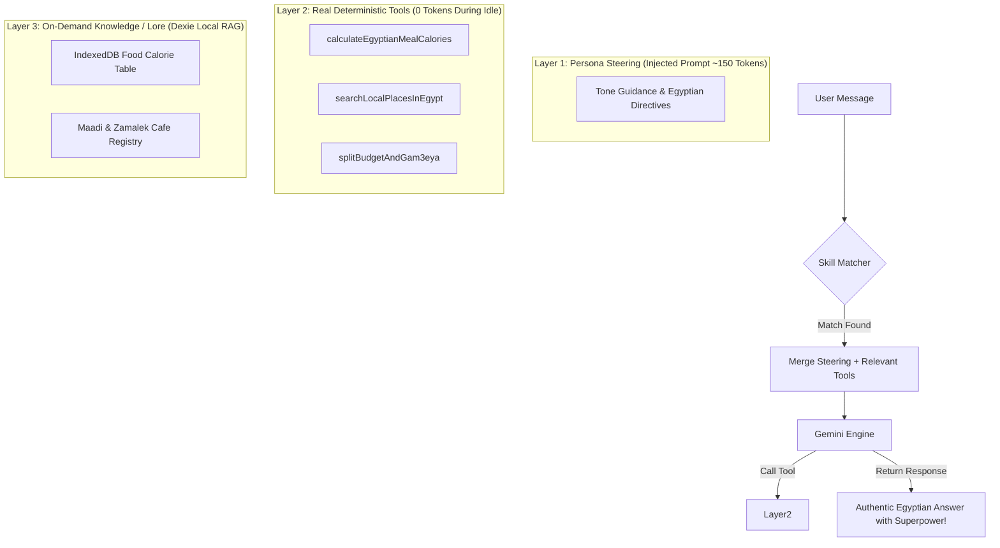

# ⚡ Rafiq Skills Architecture & Native Integration Blueprint
## "Toon-Style" Master Architectural Plan for Modular Companion Capabilities

> **Status:** Proposed & Verified  
> **Date:** September 13, 2026  
> **System:** Rafiq — Egyptian AI Companion & WhatsApp Clone  
> **Target Framework:** React + Dexie (IndexedDB) + Google Gemini API + Prompt Caching  

---

## 🎬 1. Executive Summary & The "Cast of Characters" (Toon Metaphor)

In standard AI coding agents, a **Skill** is a heavy folder of scripts, linters, and compiler hooks. But **Rafiq is NOT a coding agent** — Rafiq is an authentic, witty, emotionally intelligent Egyptian companion.

When we equip Rafiq with **Skills**, we are not giving him a bash terminal; we are giving him **"شطارات وتخصصات" (Specialized Talents & Life Roles)** — like suddenly knowing how to calculate Egyptian food calories, acting as a late-night emotional rock, or knowing the coziest coffee shops in Maadi — **all while staying 100% true to his warm Egyptian soul.**

To understand how this system operates natively without token bloat, meet our architectural cast:

```
+-----------------------------------------------------------------------------------------+
|                                  THE SKILL SYSTEM CAST                                   |
+----------------------------+-----------------------------+------------------------------+
|  🧙 The Soul Keeper        |  🎯 The Skill Conductor      |  🏰 The Cache Vault          |
|  (livingPersonaCore.ts)    |  (skillMatcher.ts)          |  (geminiService.server.ts)   |
|                            |                             |                              |
|  Guards Rafiq's Egyptian   |  A lightning-fast local     |  Locks static persona &      |
|  identity, slang, mood,    |  scout that sniffs messages |  skills into Gemini's KV-    |
|  and relationship ledger.  |  at 0 token cost using      |  Cache for 80% cheaper       |
|  Never gets overwritten!   |  normalized Arabic regex.   |  tokens & sub-second speed!  |
+----------------------------+-----------------------------+------------------------------+
|  🛠️ The Tool Crafter       |  📜 The Memory Scribe       |  🎨 The WhatsApp Hub         |
|  (services/tools/)         |  (db.ts / Dexie)            |  (SkillsHubModal.tsx)        |
|                            |                             |                              |
|  Executes real code        |  Stores user skill states   |  The sleek UI where users    |
|  (calorie math, place      |  (diet metrics, saved spots)|  toggle, browse, and pin     |
|  search) outside the LLM.  |  safely inside IndexedDB.   |  new talents onto Rafiq.     |
+----------------------------+-----------------------------+------------------------------+
```

---

## 🚀 2. The Core Challenge & The 3-Layer Solution

### The Naive Trap (What We Must NOT Do):
If an app dumps 10 installed skills into the system prompt on every turn:
- **Token Inflation:** +2,500 to +5,000 tokens per message.
- **Latency Drag:** +1.5s delay while the LLM parses inactive instructions.
- **Prompt Confusion (Hallucination):** The model mixes up gym advice with late-night venting.

### The 3-Layer Architecture Solution:



1. **Layer 1 (The Steering Protocol - ~150-250 Tokens):** We do not teach Gemini what a calorie is. We simply steer its focus: *"Speak Egyptian vernacular, prefer koshary/ful examples, stay pragmatic and humorous."*
2. **Layer 2 (The Deterministic Tools - 0 Prompt Tokens Idle):** Heavy calculations (e.g. exact macronutrients or expense splitting) are handled by typed TypeScript tools.
3. **Layer 3 (On-Demand Knowledge Slices):** Data repositories live in client-side IndexedDB; only the matched snippets are fetched.

---

## 🔒 3. The Prompt Caching & Prefix Stability Invariant

Google Gemini offers **Context Caching (Prompt Caching)** with an **80% discount on input tokens** and lightning-fast Time-To-First-Token (TTFT).  
However, Gemini's KV-cache invalidates immediately if a single character changes at the start of the prompt.

### The Architectural Invariant:
We strictly partition Rafiq's system prompt into two blocks:

```
========================= CACHED PREFIX (100% Static Across Turns) =========================
1. Base System Identity (Rafiq Companion Architecture)
2. Soul Baseline & Egyptian Vernacular Lexicon
3. Active Skills Definitions & Behavioral Directives
4. Dynamic Function Declarations (Gemini Tools Schema)
======================================= CACHE LINE =======================================
========================== VOLATILE TAIL (Changes Every Turn) ==========================
5. Runtime Awareness (Live Clock, Date, ISO Timestamp)
6. Dynamic Psychological State (Mood, Intimacy Level, Hunger, Emotional Ledger)
7. Retrieved Episodic Memory Slices (Vector/Graph Context)
8. Recent Conversation Window (Last N turns)
9. Current User Message & Attachments
========================================================================================
```

> **Benefit:** Even if the user activates 3 rich skills adding 1,200 tokens of directives and tools, **those 1,200 tokens sit behind the Cache Line**! Gemini serves them from its KV-Cache for pennies.

---

## 💾 4. Data Models & Type Specifications (`types.ts`)

```typescript
// ==========================================
// RAFIQ SKILLS ENGINE - TYPE CONTRACTS
// ==========================================

export type SkillCategory = 
  | 'emotional'     // فضفضة، مواساة، استماع
  | 'lifestyle'     // جيم، دايت، صحة
  | 'entertainment' // سينما، ألغاز، إيفيهات، فوازير
  | 'productivity'  // مصاريف، جمعيات، تنظيم مهام
  | 'cultural';     // حكايات، تاريخ مصر، نوادر

export type SkillActivationMode = 'auto' | 'explicit' | 'always_on';

export interface SkillTrigger {
  keywords: string[];        // Egyptian Arabic keywords (normalized)
  intents: string[];         // High-level intent tokens
  minConfidence?: number;    // 0.0 - 1.0 (default 0.75)
  slashCommand?: string;     // e.g. "/coach", "/vent", "/spots"
}

export interface SkillBehavior {
  titleArabic: string;       // e.g. "كوتش الجيم بالبلدي"
  toneModifier: string;      // How Rafiq's mood or cadence shifts
  instructions: string;      // Dense, unambiguous directives (150-250 tokens)
  negativeConstraints: string[]; // What Rafiq MUST NOT do in this mode
  sampleTurn?: {
    user: string;
    bot: string;
  };
}

export interface SkillToolDefinition {
  name: string;
  description: string;
  parameters: {
    type: 'object';
    properties: Record<string, { type: string; description: string; enum?: string[] }>;
    required: string[];
  };
  handlerKey: string;        // Function pointer in skillToolRegistry
}

export interface SkillDefinition {
  id: string;                // Unique slug: 'baladi-fitness', 'deep-venting'
  name: string;              // "كوتش بالبلدي"
  englishName: string;       // "Baladi Fitness Coach"
  category: SkillCategory;
  icon: string;              // Emoji or SVG icon identifier
  description: string;       // Friendly description for the user
  version: string;           // SemVer: '1.0.0'
  author: 'system' | 'community' | 'user';
  activationMode: SkillActivationMode;
  triggers: SkillTrigger;
  behavior: SkillBehavior;
  tools?: SkillToolDefinition[];
  knowledgeSnippets?: string[]; // Quick facts for the skill
  isDefaultInstalled?: boolean;
}

export interface InstalledSkillRecord {
  skillId: string;
  installedAt: Date;
  isEnabled: boolean;
  priority: number;          // Higher priority executes first on collision
  pinnedInChat: boolean;     // Shows badge in WhatsApp header
  customConfig?: Record<string, any>;
  lastActivatedAt?: Date;
  activationCount: number;
}

export interface SkillStateRecord {
  skillId: string;
  chatId: string;            // Scoped to current bot/chat
  updatedAt: Date;
  state: Record<string, any>; // e.g. { weightHistory: [85, 84.5], currentGoal: 'cutting' }
}
```

---

## 🗄️ 5. Database Schema & Dexie Integration (`services/db.ts`)

In `db.ts`, we register two new tables in the Dexie instance:
- `installedSkills`: `&skillId, isEnabled, pinnedInChat, activationCount`
- `skillStates`: `&[skillId+chatId], skillId, chatId, updatedAt`

```typescript
// Inside services/db.ts upgrade:
this.version(7).stores({
  installedSkills: 'skillId, isEnabled, pinnedInChat, activationCount, installedAt',
  skillStates: '[skillId+chatId], skillId, chatId, updatedAt',
});
```

---

## ⚡ 6. Zero-LLM Local Matcher Engine (`services/skillMatcher.ts`)

Leverages Rafiq's existing `normalizeArabicForSearch` to achieve sub-millisecond evaluation with **zero external API calls**:

```typescript
// services/skillMatcher.ts
import { normalizeArabicForSearch } from './lorebookEngine.js';
import { SkillDefinition, InstalledSkillRecord } from '../types.js';

export interface MatchResult {
  skill: SkillDefinition;
  score: number;
  triggerWord: string;
  matchedBy: 'slash' | 'keyword' | 'explicit';
}

export function matchActiveSkills(
  userText: string,
  installedSkills: SkillDefinition[]
): MatchResult | null {
  if (!userText || installedSkills.length === 0) return null;

  const trimmed = userText.trim();
  const normalized = normalizeArabicForSearch(trimmed);

  // 1. Check Slash Commands (/coach, /vent, /جيم)
  for (const skill of installedSkills) {
    if (skill.triggers.slashCommand && trimmed.startsWith(skill.triggers.slashCommand)) {
      return { skill, score: 100, triggerWord: skill.triggers.slashCommand, matchedBy: 'slash' };
    }
  }

  // 2. Keyword Matching with Boundary & Priority Weighting
  let bestMatch: MatchResult | null = null;
  let highestScore = 0;

  for (const skill of installedSkills) {
    if (skill.activationMode === 'explicit') continue;

    for (const keyword of skill.triggers.keywords) {
      const normKeyword = normalizeArabicForSearch(keyword);
      if (normalized.includes(normKeyword)) {
        const score = normKeyword.length * 2 + (skill.category === 'lifestyle' ? 5 : 3);
        if (score > highestScore) {
          highestScore = score;
          bestMatch = { skill, score, triggerWord: keyword, matchedBy: 'keyword' };
        }
      }
    }
  }

  return bestMatch;
}
```

---

## 🌟 7. Flagship Built-In Starter Skills

### Skill 1: "كوتش بالبلدي" (`baladi-fitness`)
* **Role:** An authentic Egyptian gym buddy who knows street foods, breaks fitness jargon down, and never shames you.
* **Keywords:** `جيم, دايت, كشري, سعرات, بروتين, تمرين, عضلات, تخسيس, بطن, كرياتين`
* **Directives:** *"Prioritize affordable Egyptian nutrition (koshary, eggs, ful, grilled chicken, cottage cheese / gebna areesh). Use realistic fitness advice. If user feels lazy, act like a genuine Egyptian friend giving tough love without being harsh."*
* **Tool:** `calculateBaladiCalories(foodItem: string, quantity: string)`

### Skill 2: "فضفضة 3 الفجر" (`deep-venting`)
* **Role:** A warm, late-night safe space. Stops joking around; focuses on empathetic active listening.
* **Keywords:** `مخنوق, مضايق, تعبان نفسيا, حاسس بوحدة, مش طايق, هموت من التفكير, فضفضة`
* **Directives:** *"Strict anti-toxic positivity rule. Do NOT immediately propose solutions or cheer up tropes. Validate their feelings first using warm Egyptian colloquial phrases ('حقك عليا', 'أنا سامعك وساندك', 'فضفض براحتك'). Ask open questions to help them unload their chest."*
* **Negative Constraints:** *"Never say 'كل حاجة هتكون كويسة' or offer 5-step life plans unless explicitly requested."*

### Skill 3: "دليل الفسح والانتخة" (`outings-hunter`)
* **Role:** The ultimate Cairo & Alex guide for work-friendly cafes, cozy spots, and budget dates.
* **Keywords:** `خروجة, كافيه, مكان أذاكر فيه, انتخة, مطعم رايق, وسط البلد, المعادي, التجمع, زايد`
* **Directives:** *"Recommend places categorized by vibe (working/studying, casual hangout, budget outing). Mention real Egyptian neighborhoods with nuance."*
* **Tool:** `queryEgyptianSpots(city: string, area: string, vibe: string, budgetLevel: string)`

---

## 📱 8. WhatsApp-Native UI/UX Flow

```
+-------------------------------------------------------------------------------+
| [<-]  (Avatar) Rafiq       [💪 Coach Mode Active]             [🔍] [⋮]       |
+-------------------------------------------------------------------------------+
|                                                                               |
|  (User)  ضربت النهاردة طبق كشري كبير بالدقة وحاسس بالذنب!                      |
|                                                                               |
|  (Rafiq) [💪 كوتش بالبلدي]                                                    |
|          يا عم ولا تشيل هم! طبق الكشري المتوسط فيه حوالي 650 لـ 800 سعر،      |
|          المهم تكون شربت مياه كفاية وما حبستش بعدها بحاجة مسكرة.              |
|          انزل بكره العب نص ساعة مشي سريع أو تمرينة كارديو خفيفة               |
|          وهتلاقي الدنيا اتظبطت، الكشري مش جريمة ده وقود! 😉                  |
|                                                                               |
+-------------------------------------------------------------------------------+
|  [/]  | اكتب رسالة... أو استخدم /coach أو /vent                | [📎] [🎤] [▶] |
+-------------------------------------------------------------------------------+
```

1. **Skills Drawer (`SkillsHubModal.tsx`):**
   - Accessible from the chat header or WhatsApp sidebar settings.
   - Cards showing each skill with status toggles (On/Off), usage count, and tags.
2. **Active Mode Pill in Chat Header:**
   - When a skill activates, a subtle badge appears in the top navigation bar (e.g. `[💪 كوتش بالبلدي]`), letting the user know Rafiq is in specialized mode.
3. **Slash Commands Helper:**
   - Typing `/` in the message input brings up a clean popup menu with available skills.

---

## 🗺️ 9. File-Level Change Map

| Action | File Path | Responsibility |
| :--- | :--- | :--- |
| **[MODIFY]** | `types.ts` | Add `SkillDefinition`, `SkillCategory`, `InstalledSkillRecord`, `SkillStateRecord`. |
| **[MODIFY]** | `services/db.ts` | Register `installedSkills` and `skillStates` object stores in Dexie schema. |
| **[NEW]** | `services/skillRegistry.ts` | The built-in catalog of system skills, default seeders, and retrieval methods. |
| **[NEW]** | `services/skillMatcher.ts` | Sub-millisecond normalized Arabic regex and slash-command matcher. |
| **[NEW]** | `services/tools/baladiNutritionTool.ts` | Calorie calculation and Egyptian food database tool. |
| **[MODIFY]** | `services/geminiService.server.ts` | Reorganize system prompt to enforce **Prefix Stability**; inject active skill directives at the correct cache boundary. |
| **[NEW]** | `components/SkillsHubModal.tsx` | WhatsApp-themed modal to browse, install, configure, and toggle skills. |
| **[MODIFY]** | `components/ChatInterface.tsx` | Add active skill badge in header, slash command autocomplete, and skills modal trigger. |
| **[NEW]** | `tests/skillMatcher.test.ts` | Unit tests for Arabic normalization, keyword triggering, and zero-collision safety. |

---

## 🧪 10. Verification & Quality Assurance Plan

1. **Unit Testing (`bun test tests/skillMatcher.test.ts`):**
   - Verify Arabic diacritics stripping (تنوين، تشكيل، همزات).
   - Test keyword matching with multi-word slang.
   - Ensure standard messages ("صباح الخير يا رفيق") return `null` match with 0 overhead.
2. **Token Economy Benchmark:**
   - Compare prompt token counts before and after skill activation.
   - Verify that inactive skills add **exactly 0 tokens** to the Gemini call.
   - Verify that active skills stay under the 250-token budget.
3. **Prompt Caching Verification:**
   - Validate that the System Prompt prefix remains character-for-character identical across consecutive turns.
   - Verify Gemini API responses return cached token indicators where supported.
4. **End-to-End Build Audit:**
   - Execute `bun run build` / `npm run build` ensuring 0 TypeScript compiler errors.
   - Test UI responsiveness on mobile and desktop viewports.
