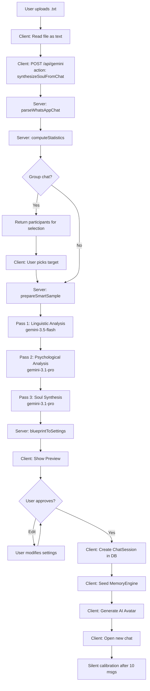

# 🧬 WhatsApp Chat Clone → Rafiq: Deep Architecture Plan

> **Mission:** Let a user export a WhatsApp chat (`.txt`), upload it, and have the system analyze the conversation to "clone" the other person as a fully functional Rafiq — with their exact slang, mood patterns, emoji habits, relationship dynamics, and psychological profile — all powered by Gemini's most capable models.

---

## Table of Contents

1. [Problem Analysis](#1-problem-analysis)
2. [Current System Audit](#2-current-system-audit)
3. [Architecture Vision](#3-architecture-vision)
4. [Phase 1: Smart Parser Engine (Hardened)](#4-phase-1-smart-parser-engine)
5. [Phase 2: Multi-Pass AI Analysis Pipeline](#5-phase-2-multi-pass-ai-analysis-pipeline)
6. [Phase 3: Soul Synthesis Engine](#6-phase-3-soul-synthesis-engine)
7. [Phase 4: Memory Seeding from Chat History](#7-phase-4-memory-seeding-from-chat-history)
8. [Phase 5: UI/UX — Import Wizard Flow](#8-phase-5-uiux-import-wizard-flow)
9. [Phase 6: Post-Creation Calibration Loop](#9-phase-6-post-creation-calibration-loop)
10. [Data Flow Diagram](#10-data-flow-diagram)
11. [File-Level Change Map](#11-file-level-change-map)
12. [Security & Privacy](#12-security--privacy)
13. [Testing & Verification](#13-testing--verification)

---

## 1. Problem Analysis

### The WhatsApp Export Problem
WhatsApp's "Export Chat" produces a `.txt` file that is **notoriously inconsistent**:

| Problem | Example |
|---------|---------|
| **Arabic Indic digits** | `١٢/٠٣/٢٠٢٥` instead of `12/03/2025` |
| **Invisible Unicode** | LTR/RTL marks, zero-width joiners, non-breaking spaces |
| **iOS vs Android format** | `[Date, Time] Sender: Msg` vs `Date, Time - Sender: Msg` |
| **Arabic AM/PM** | `ص` / `م` instead of AM/PM |
| **Multiline messages** | Messages spanning 2-5 lines without a new timestamp |
| **System messages** | "Messages and calls are end-to-end encrypted", "You added X", media omitted |
| **Mixed languages** | Franco-Arabic (`a7a`, `ya3ni`), pure Arabic, English, code-switching mid-sentence |
| **Phone numbers as names** | `+20 123 456 7890` instead of contact names |
| **Date format ambiguity** | `12/03/2025` — is this Dec 3 or Mar 12? |
| **Huge file sizes** | Multi-year chats can be 10-50MB+ |

### The Clone Problem
Cloning a person is not just about *what* they say — it's about:

1. **Linguistic DNA** — Their exact slang, typos, emoji patterns, punctuation style
2. **Emotional Architecture** — What triggers them, how they escalate, how they de-escalate
3. **Relationship Dynamics** — Are they the dominant one? The supportive one? The sarcastic one?
4. **Temporal Patterns** — Do they send long messages at night? Short bursts in the morning?
5. **Topic Obsessions** — What do they keep bringing up? What do they avoid?
6. **Communication Rhythm** — Do they double-text? Split messages? Send voice note indicators?

---

## 2. Current System Audit

### What Already Exists ✅

| Component | File | Status |
|-----------|------|--------|
| WhatsApp parser | `services/whatsappImporter.server.ts` | ✅ Exists — robust regex, Arabic normalization, iOS/Android support |
| AI analysis endpoint | `services/whatsappImporter.server.ts` → `analyzeChatAndGeneratePersona()` | ✅ Exists — single-pass Gemini analysis |
| Client-side caller | `services/whatsappImporter.ts` | ✅ Exists — thin fetch wrapper |
| API route | `api/gemini.ts` → `analyzeChatAndGeneratePersona` | ✅ Registered as action |
| Soul Registry | `services/soulRegistry.ts` | ✅ 5 archetypes + mixer system |
| Persona Engine | `services/personaEngine.ts` | ✅ Full system prompt compiler |
| Memory Engine | `services/memoryEngine.ts` | ✅ Boost memory indexing |
| Dynamic Engines | `services/dynamicEngines.ts` | ✅ Mood, expression, relationship stages |
| Human Realism | `services/humanRealism.ts` | ✅ Anti-AI behavioral layer |
| NewChatModal | `components/NewChatModal.tsx` | ✅ Has `import` mode tab infrastructure (unused) |

### What's Missing / Weak ❌

| Gap | Impact |
|-----|--------|
| **Single-pass AI analysis** | Current approach sends one giant prompt → Gemini often produces shallow results for long chats |
| **No Soul Trait extraction** | Analysis returns `BotSettings` but doesn't compute `SoulTraits` (chaos/empathy/slang/intellect/positivity) |
| **No memory seeding** | Cloned persona starts with zero memories — doesn't remember anything from the original chat |
| **No conversation style derivation** | Doesn't derive `ConversationStylePreset` or `ReplyShapePolicy` from the analysis |
| **No UI for import flow** | The `import` mode tab is defined in state but has no rendered UI |
| **No progress feedback** | Multi-minute analysis with zero user feedback |
| **No participant selector** | Group chats have multiple participants — no way for user to pick who to clone |
| **No validation/preview** | User can't see/edit the AI's analysis before creating the Rafiq |

---

## 3. Architecture Vision

### The Three-Brain Pipeline

Instead of one monolithic prompt, we use a **3-pass pipeline** where each pass is specialized:

```
┌─────────────────────────────────────────────────────────────────┐
│                    WhatsApp .txt File                            │
└─────────────┬───────────────────────────────────────────────────┘
              │
              ▼
┌─────────────────────────────────────────────────────────────────┐
│  STAGE 0: SMART PARSER                                          │
│  • Normalize Unicode/Arabic digits                              │
│  • Detect iOS vs Android format                                 │
│  • Parse into structured ParsedMessage[]                        │
│  • Identify participants & message counts                       │
│  • Truncate to last 4MB if oversized                           │
│  • OUTPUT: ChatAnalysisInput (structured data)                  │
└─────────────┬───────────────────────────────────────────────────┘
              │
              ▼
┌─────────────────────────────────────────────────────────────────┐
│  STAGE 1: LINGUISTIC BRAIN (gemini-3.5-flash)                   │
│  "The Linguist"                                                 │
│  • Analyze slang vocabulary & frequency                         │
│  • Map emoji patterns & density                                 │
│  • Detect typing style (punctuation, capitalization, splitting) │
│  • Identify code-switching patterns (Arabic/English/Franco)     │
│  • Measure message length distribution                          │
│  • Detect response timing patterns                              │
│  • OUTPUT: LinguisticProfile                                    │
└─────────────┬───────────────────────────────────────────────────┘
              │
              ▼
┌─────────────────────────────────────────────────────────────────┐
│  STAGE 2: PSYCHOLOGICAL BRAIN (gemini-3.1-pro-preview)          │
│  "The Psychologist"                                             │
│  • Deep personality analysis (Big 5 mapped to SoulTraits)       │
│  • Emotional triggers & de-escalation patterns                  │
│  • Attachment style detection                                   │
│  • Conflict resolution style                                    │
│  • Relationship dynamic with the user                           │
│  • Topic obsessions & avoidances                                │
│  • INPUT: Raw chat + LinguisticProfile                          │
│  • OUTPUT: PsychologicalProfile                                 │
└─────────────┬───────────────────────────────────────────────────┘
              │
              ▼
┌─────────────────────────────────────────────────────────────────┐
│  STAGE 3: SOUL SYNTHESIZER (gemini-3.1-pro-preview)             │
│  "The Ghostwriter"                                              │
│  • Compiles LinguisticProfile + PsychologicalProfile            │
│  • Generates the impersonation_profile (system instruction)     │
│  • Generates the bio (1st person life story)                    │
│  • Computes SoulTraits (chaos/empathy/slang/intellect/positivity│
│  • Selects best matching SoulArchetype                          │
│  • Derives dialect, voice config, chattiness                    │
│  • Extracts key memories to seed                                │
│  • OUTPUT: Complete SoulBlueprint                               │
└─────────────┬───────────────────────────────────────────────────┘
              │
              ▼
┌─────────────────────────────────────────────────────────────────┐
│  STAGE 4: RAFIQ CREATION                                        │
│  • Create BotSettings from SoulBlueprint                        │
│  • Create ChatSession in IndexedDB                              │
│  • Seed MemoryEngine with extracted memories                    │
│  • Generate AI avatar from profile                              │
│  • Open the new chat                                            │
└─────────────────────────────────────────────────────────────────┘
```

---

## 4. Phase 1: Smart Parser Engine

### Current Parser: `parseWhatsAppChat()` — Already Strong ✅

The existing parser in `whatsappImporter.server.ts` already handles:
- Arabic Indic digit conversion
- iOS `[Date, Time] Sender: Msg` format
- Android `Date, Time - Sender: Msg` format
- Unicode cleanup (LTR/RTL marks, zero-width joiners)
- System message filtering
- Multiline message continuation
- 4MB truncation for oversized files

### Enhancements Needed

#### 1. Chat Statistics Extraction (NEW)

After parsing, compute metadata that the AI passes need:

```typescript
interface ChatStatistics {
  totalMessages: number;
  participants: ParticipantProfile[];
  dateRange: { start: Date; end: Date };
  dominantLanguage: 'arabic' | 'english' | 'franco' | 'mixed';
  averageMessagesPerDay: number;
  isGroupChat: boolean;
}

interface ParticipantProfile {
  name: string;
  messageCount: number;
  averageMessageLength: number;
  emojiFrequency: number;       // emojis per message
  questionFrequency: number;     // questions per 100 messages
  mediaMessageCount: number;     // "image omitted", "video omitted"
  activeHours: number[];         // hours of day they're most active (0-23)
  longestMessage: number;        // character count
  shortestMessage: number;
  fragmentedMessageRatio: number; // consecutive messages within 60s / total
}
```

This metadata:
- Lets the user pick the right target (in group chats)
- Gives the AI structured data instead of raw messy text
- Helps compute `SoulTraits` with actual numbers

#### 2. Smart Sampling Strategy (NEW)

Instead of just taking the last 600 messages, use **stratified sampling**:

```typescript
const prepareSmartSample = (messages: ParsedMessage[], targetName: string): string => {
  const targetMessages = messages.filter(m => m.sender === targetName);
  
  // Strategy: Take diverse samples across the timeline
  const samples = {
    recent: targetMessages.slice(-200),      // Recent behavior (strongest signal)
    middle: sampleEvenly(targetMessages, 100, 0.3, 0.7),  // Mid-history diversity
    emotional: filterEmotional(targetMessages, 50),  // High-emotion messages
    long: filterByLength(targetMessages, 50, 'longest'),  // Deep thoughts
    short: filterByLength(targetMessages, 30, 'shortest'), // Quick reactions
    conversations: extractConversationPairs(messages, targetName, 100), // Back-and-forth
  };
  
  return formatSamples(samples);
};
```

This gives the AI a **360-degree view** instead of just the tail end.

#### 3. Enhanced System Message Filtering (UPGRADE)

Add filters for Arabic system messages:

```typescript
const SYSTEM_MESSAGE_PATTERNS = [
  /omitted/i,
  /end-to-end encryption/i,
  /waiting for this message/i,
  /created group/i,
  /added you/i,
  /left the group/i,
  /changed the subject/i,
  /changed the group icon/i,
  // Arabic additions
  /تم حذف هذه الرسالة/,
  /الرسائل والمكالمات مشفرة/,
  /تم تغيير الموضوع/,
  /غادر المجموعة/,
  /أضاف/,
  /تم الحذف/,
  /تمت الإضافة/,
  /وسائط محذوفة/,
  /هذه الرسالة محذوفة/,
];
```

---

## 5. Phase 2: Multi-Pass AI Analysis Pipeline

### Pass 1: The Linguist 🗣️

**Model:** `gemini-3.5-flash` (fastest, cheapest — language is pattern recognition)

**Input:** 400 sampled messages from target person

**Structured Output Schema:**

```typescript
interface LinguisticProfile {
  // Vocabulary
  signatureWords: string[];        // Top 20 most-used distinctive words/phrases
  slangInventory: string[];        // Specific slang terms with usage examples
  fillerWords: string[];           // "يعني", "اصلًا", "فاهم؟"
  greetingPatterns: string[];      // How they start conversations
  farewellPatterns: string[];      // How they end conversations
  
  // Typing Style
  typingStyle: {
    averageSentenceLength: 'very_short' | 'short' | 'medium' | 'long' | 'very_long';
    usePunctuation: boolean;
    useCapitalization: 'never' | 'sometimes' | 'always';
    splitMessages: boolean;         // Do they send one big message or fragments?
    useCorrections: boolean;        // Do they correct typos with *?
    useAbbreviations: boolean;      // "btw", "imo", "7lw"
  };
  
  // Emoji DNA
  emojiProfile: {
    density: 'none' | 'sparse' | 'moderate' | 'heavy' | 'excessive';
    favorites: string[];            // Top 10 most-used emojis
    emotionalMapping: Record<string, string[]>; // "happy" → ["😂", "🤣"], "sad" → ["🥺", "💔"]
    usesAsReaction: boolean;        // Do they send emoji-only messages?
  };
  
  // Language Mixing
  languageMix: {
    primary: 'arabic' | 'english' | 'franco';
    secondary: 'arabic' | 'english' | 'franco' | 'none';
    switchTriggers: string[];       // When do they switch? ("technical topics", "joking", "angry")
    francoFrequency: 'never' | 'rare' | 'moderate' | 'heavy';
  };
  
  // Communication Rhythm
  rhythm: {
    responseSpeed: 'instant' | 'quick' | 'normal' | 'slow' | 'variable';
    burstMessaging: boolean;        // Multiple messages in rapid succession
    averageBurstSize: number;       // If burst, how many messages per burst?
    useVoiceNoteIndicators: boolean; // "هبعتلك فويس"
    mediaSharing: 'rare' | 'moderate' | 'frequent';
  };
}
```

**Why a separate pass?** Linguistic analysis is **objective and measurable** — it doesn't need deep reasoning, just pattern recognition. Flash models excel at this.

### Pass 2: The Psychologist 🧠

**Model:** `gemini-3.1-pro-preview` (deepest reasoning — psychology needs nuance)

**Input:** 400 sampled messages (with context pairs) + LinguisticProfile from Pass 1

**Structured Output Schema:**

```typescript
interface PsychologicalProfile {
  // Core Personality
  personality: {
    openness: number;           // 0-100
    conscientiousness: number;   // 0-100
    extraversion: number;        // 0-100
    agreeableness: number;       // 0-100
    neuroticism: number;         // 0-100
  };
  
  // Emotional Architecture
  emotionalProfile: {
    baseline_mood: 'happy' | 'neutral' | 'anxious' | 'melancholic' | 'energetic';
    emotional_range: 'narrow' | 'moderate' | 'wide' | 'extreme';
    triggers: {
      anger: string[];           // What makes them angry? (e.g., "being ignored", "disrespect")
      joy: string[];             // What makes them happy?
      anxiety: string[];         // What makes them anxious?
      sadness: string[];         // What makes them sad?
    };
    copingMechanisms: string[];  // How do they cope? ("humor", "withdrawal", "venting")
    emotionalVulnerabilities: string[];
  };
  
  // Relationship Dynamics
  relationshipDynamics: {
    role: 'leader' | 'supporter' | 'equal' | 'submissive' | 'challenger';
    attachmentStyle: 'secure' | 'anxious' | 'avoidant' | 'disorganized';
    conflictStyle: 'confrontational' | 'passive_aggressive' | 'avoidant' | 'collaborative';
    loyaltyLevel: 'low' | 'moderate' | 'high' | 'extreme';
    boundaryStyle: 'rigid' | 'healthy' | 'flexible' | 'none';
    affectionStyle: string;      // How they show care
    relationshipTypeWithUser: string; // "best_friend", "partner", etc.
  };
  
  // Cognitive Style
  cognitiveStyle: {
    thinkingDepth: 'surface' | 'moderate' | 'deep' | 'philosophical';
    decisionMaking: 'impulsive' | 'intuitive' | 'analytical' | 'overthinking';
    humorStyle: 'sarcastic' | 'dry' | 'slapstick' | 'dark' | 'punny' | 'none';
    topicObsessions: string[];   // What do they keep bringing up?
    topicAvoidances: string[];   // What do they avoid?
    intellectualCuriosity: 'low' | 'moderate' | 'high';
  };
  
  // Social Behavior
  socialBehavior: {
    chattiness: 'low' | 'balanced' | 'high';
    initiatesConversation: boolean;
    askesQuestions: boolean;      // Do they ask about the other person?
    sharesSelfInfo: boolean;     // Do they volunteer personal info?
    gossiping: boolean;          // Do they talk about others?
    complaintFrequency: 'rare' | 'moderate' | 'frequent';
  };
}
```

**Why Pro?** Psychological analysis requires reading between the lines, understanding subtext, and making nuanced judgments. This needs the strongest model.

### Pass 3: The Ghostwriter ✍️

**Model:** `gemini-3.1-pro-preview` (creative synthesis needs strong reasoning)

**Input:** LinguisticProfile + PsychologicalProfile + 100 example messages

**Structured Output Schema:**

```typescript
interface SoulBlueprint {
  // Identity
  identity: {
    name: string;
    inferredGender: 'male' | 'female';
    inferredAge: number;
    bio: string;                 // 1st person, 3-4 paragraphs, in their language
  };
  
  // System Instruction (THE CRITICAL OUTPUT)
  impersonationProfile: string;  // 5-7 paragraph "ghostwriter's bible"
  // This is the text that goes into the system prompt.
  // It must capture:
  //   - Exact vocabulary and phrasing rules
  //   - Emoji usage rules
  //   - Emotional response patterns
  //   - Topic-specific behaviors
  //   - Relationship dynamic rules
  //   - What to NEVER say/do
  //   - What they ALWAYS do
  
  // Soul Traits (0-100)
  soulTraits: {
    chaos: number;
    empathy: number;
    slang: number;
    intellect: number;
    positivity: number;
  };
  
  // Best Matching Archetype
  bestArchetypeId: string;       // "amira_default" | "chaotic_bestie" | "wise_mentor" | etc.
  archetypeConfidence: number;   // 0-100
  
  // Configuration
  config: {
    chattiness: 'low' | 'balanced' | 'high';
    fragmentedMessages: boolean;
    dialect: 'cairo_modern' | 'alexandrian' | 'saidi' | 'franko';
    relationshipType: string;    // RelationType enum value
    voiceTone: 'sweet' | 'husky' | 'flat' | 'energetic';
    voicePitch: number;          // 0.5-1.5
    voiceSpeed: number;          // 0.5-1.5
  };
  
  // Memory Seeds (Key facts to remember)
  memorySeeds: Array<{
    text: string;
    category: 'identity' | 'preference' | 'memory' | 'goal' | 'fact' | 'emotion';
    salience: number;            // 0-1
  }>;
}
```

---

## 6. Phase 3: Soul Synthesis Engine

### New Service: `services/soulSynthesizer.ts`

This is the **orchestrator** that ties the three AI passes together:

```typescript
// services/soulSynthesizer.ts

interface SoulSynthesisResult {
  blueprint: SoulBlueprint;
  settings: BotSettings;
  memorySeeds: MemoryEntry[];
  statistics: ChatStatistics;
  confidence: {
    linguistic: number;
    psychological: number;
    overall: number;
  };
}

interface SynthesisProgress {
  stage: 'parsing' | 'linguistic' | 'psychological' | 'synthesis' | 'creating' | 'done' | 'error';
  progress: number;        // 0-100
  message: string;         // Human-readable Arabic status
  stageDetail?: string;    // Optional sub-detail
}

export const synthesizeSoulFromChat = async (
  fileContent: string,
  targetNameHint: string | undefined,
  onProgress: (progress: SynthesisProgress) => void
): Promise<SoulSynthesisResult> => {
  // Stage 0: Parse
  onProgress({ stage: 'parsing', progress: 5, message: 'بقرأ المحادثة...' });
  const messages = parseWhatsAppChat(fileContent);
  const statistics = computeStatistics(messages);
  const targetName = resolveTargetName(messages, statistics, targetNameHint);
  
  // Stage 1: Linguistic Analysis
  onProgress({ stage: 'linguistic', progress: 20, message: 'بحلل أسلوب الكلام...' });
  const sample = prepareSmartSample(messages, targetName);
  const linguisticProfile = await analyzeLinguistically(sample, targetName);
  
  // Stage 2: Psychological Analysis
  onProgress({ stage: 'psychological', progress: 50, message: 'بفهم الشخصية...' });
  const contextPairs = extractConversationPairs(messages, targetName, 100);
  const psychProfile = await analyzePhychologically(contextPairs, linguisticProfile, targetName);
  
  // Stage 3: Soul Synthesis
  onProgress({ stage: 'synthesis', progress: 75, message: 'ببني الروح...' });
  const blueprint = await synthesizeSoul(linguisticProfile, psychProfile, targetName, sample);
  
  // Stage 4: Create Settings & Memories
  onProgress({ stage: 'creating', progress: 90, message: 'بجهز الرفيق...' });
  const settings = blueprintToSettings(blueprint);
  const memorySeeds = blueprintToMemories(blueprint, statistics);
  
  onProgress({ stage: 'done', progress: 100, message: 'الرفيق جاهز!' });
  
  return { blueprint, settings, memorySeeds, statistics, confidence: { ... } };
};
```

### Archetype Matching Algorithm

Map the AI's psychological analysis to the existing `SOUL_ARCHETYPES`:

```typescript
const matchArchetype = (traits: SoulTraits): { id: string; confidence: number } => {
  const archetypes = SOUL_ARCHETYPES.map(soul => {
    const distance = Math.sqrt(
      Math.pow(soul.baseTraits.chaos - traits.chaos, 2) +
      Math.pow(soul.baseTraits.empathy - traits.empathy, 2) +
      Math.pow(soul.baseTraits.slang - traits.slang, 2) +
      Math.pow(soul.baseTraits.intellect - traits.intellect, 2) +
      Math.pow(soul.baseTraits.positivity - traits.positivity, 2)
    );
    // Max possible distance ≈ 224 (all traits 0 vs 100)
    const confidence = Math.round(Math.max(0, 100 - (distance / 2.24)));
    return { id: soul.id, confidence, distance };
  });
  
  archetypes.sort((a, b) => a.distance - b.distance);
  return { id: archetypes[0].id, confidence: archetypes[0].confidence };
};
```

If no archetype matches well (confidence < 40), the system creates a **"Custom Soul"** with:
- `soulId: 'custom_clone'`
- Fully custom traits from the analysis
- The impersonation profile as the primary behavioral driver

### Trait Computation from Psychology

Map the Big 5 + behavioral signals to SoulTraits:

```typescript
const computeTraitsFromPsychology = (psych: PsychologicalProfile, ling: LinguisticProfile): SoulTraits => {
  return {
    chaos: clamp(
      psych.personality.openness * 0.3 +
      (psych.cognitiveStyle.decisionMaking === 'impulsive' ? 30 : 0) +
      (psych.emotionalProfile.emotional_range === 'extreme' ? 25 : 10) +
      (ling.rhythm.burstMessaging ? 15 : 0)
    ),
    
    empathy: clamp(
      psych.personality.agreeableness * 0.4 +
      (psych.socialBehavior.askesQuestions ? 20 : 0) +
      (psych.relationshipDynamics.attachmentStyle === 'secure' ? 15 : 5) +
      (psych.emotionalProfile.copingMechanisms.includes('empathy') ? 15 : 0)
    ),
    
    slang: clamp(
      (ling.languageMix.francoFrequency === 'heavy' ? 90 : 
       ling.languageMix.francoFrequency === 'moderate' ? 65 : 40) * 0.4 +
      ling.slangInventory.length * 3 +
      (ling.typingStyle.useAbbreviations ? 15 : 0) +
      (ling.emojiProfile.density === 'heavy' ? 10 : 0)
    ),
    
    intellect: clamp(
      psych.personality.openness * 0.3 +
      (psych.cognitiveStyle.thinkingDepth === 'deep' ? 30 : 
       psych.cognitiveStyle.thinkingDepth === 'philosophical' ? 40 : 15) +
      (psych.cognitiveStyle.intellectualCuriosity === 'high' ? 20 : 5) +
      (ling.typingStyle.averageSentenceLength === 'long' ? 10 : 0)
    ),
    
    positivity: clamp(
      (100 - psych.personality.neuroticism) * 0.3 +
      (psych.emotionalProfile.baseline_mood === 'happy' ? 25 : 
       psych.emotionalProfile.baseline_mood === 'energetic' ? 30 : 10) +
      psych.personality.extraversion * 0.2 +
      (psych.socialBehavior.complaintFrequency === 'frequent' ? -15 : 10)
    ),
  };
};
```

---

## 7. Phase 4: Memory Seeding from Chat History

### Why Memory Seeding Matters

Without memory seeding, the clone says: "أنا مش فاكر" to everything.

With memory seeding, the clone remembers:
- "The user's favorite food is كشري"
- "The user works in IT"
- "The user is scared of spiders"
- "We had a big fight in January about X"
- "The user's mother is named أم أحمد"

### Implementation

The `SoulBlueprint.memorySeeds` from Pass 3 are converted to `MemoryEntry[]` and bulk-inserted into IndexedDB:

```typescript
const seedMemories = async (chatId: string, seeds: SoulBlueprint['memorySeeds']) => {
  const entries: MemoryEntry[] = seeds.map((seed, i) => ({
    id: `${chatId}:seed_${i}`,
    chatId,
    sourceMessageId: `seed_${i}`,
    sourceRole: MessageRole.USER,  // Treat as user-sourced facts
    text: seed.text,
    summary: seed.text.length > 180 ? seed.text.slice(0, 177) + '...' : seed.text,
    normalizedText: normalizeText(seed.text),
    keywords: tokenize(seed.text),
    category: seed.category,
    salience: seed.salience,
    createdAt: new Date(),
    updatedAt: new Date(),
  }));
  
  await DB.bulkUpsertMemoryEntries(entries);
};
```

The Rafiq is created with `boostRafiq: true` so the memory engine is active from message #1.

### What the AI Extracts as Memory Seeds

The AI is instructed to extract ~15-30 key facts:

| Category | Example |
|----------|---------|
| `identity` | "User's name is Ahmed, works in software engineering" |
| `preference` | "Loves sushi, hates Egyptian pop music" |
| `memory` | "They traveled to Istanbul together last summer" |
| `goal` | "User wants to move to Dubai" |
| `fact` | "User has a younger sister named Nour" |
| `emotion` | "User gets anxious about job interviews" |

---

## 8. Phase 5: UI/UX — Import Wizard Flow

### The Import Flow: A 4-Step Wizard

The existing `NewChatModal` has an `import` mode but no UI. We build a **wizard** inside it:

```
Step 1: Upload        →  Step 2: Participant  →  Step 3: Analysis  →  Step 4: Preview
┌──────────────┐      ┌──────────────────┐     ┌───────────────┐     ┌──────────────┐
│ 📁            │      │ 🎯 Pick Person    │     │ 🧠 AI Working │     │ 👤 Preview   │
│              │      │                  │     │               │     │              │
│ Drop .txt    │      │ ○ Ahmed (342 msgs)│     │ ████████░░ 67%│     │ Name: أمنية  │
│ here         │      │ ● Sara (289 msgs) │     │               │     │ Age: 24      │
│              │      │ ○ +201234 (45 msgs)│    │ "بفهم الشخصية" │     │ Soul: 🦁    │
│ or click     │      │                  │     │               │     │ Traits: ...  │
│ to browse    │      │ Auto-detected:   │     │ ⚡ Stage 2/3   │     │ Bio: ...     │
│              │      │ Sara ✨           │     │               │     │              │
│ Supports:    │      │                  │     │               │     │ [Edit] [Save]│
│ .txt exports │      │                  │     │               │     │              │
└──────────────┘      └──────────────────┘     └───────────────┘     └──────────────┘
```

### Step 1: Upload

```tsx
// File drop zone with validation
const ImportUploadStep = () => (
  <div className="flex flex-col items-center justify-center p-8">
    <div 
      className="w-full border-2 border-dashed border-gray-300 rounded-2xl p-12 
                 hover:border-wa-teal hover:bg-green-50 transition-all cursor-pointer
                 flex flex-col items-center gap-4"
      onDrop={handleFileDrop}
      onDragOver={handleDragOver}
      onClick={() => fileInputRef.current?.click()}
    >
      <Upload size={48} className="text-gray-400" />
      <div className="text-center">
        <p className="font-bold text-gray-700">اسحب ملف المحادثة هنا</p>
        <p className="text-xs text-gray-400 mt-1">أو اضغط لاختيار الملف</p>
        <p className="text-[10px] text-gray-300 mt-3">يدعم: .txt من WhatsApp Export Chat</p>
      </div>
    </div>
    
    {/* How to export guide */}
    <div className="mt-6 bg-blue-50 rounded-xl p-4 text-xs text-blue-700">
      <p className="font-bold mb-2">🤔 ازاي أصدر المحادثة من واتساب؟</p>
      <ol className="list-decimal list-inside space-y-1">
        <li>افتح المحادثة في واتساب</li>
        <li>اضغط ⋮ (القائمة) → More → Export Chat</li>
        <li>اختر "Without Media"</li>
        <li>ارفع الملف .txt هنا</li>
      </ol>
    </div>
  </div>
);
```

### Step 2: Participant Selection

Only shown if the chat has 2+ named participants (not group system messages):

```tsx
const ImportParticipantStep = ({ statistics }: { statistics: ChatStatistics }) => (
  <div className="p-6 space-y-4">
    <h4 className="font-bold text-gray-700">🎯 مين عايز تعمله Clone؟</h4>
    <p className="text-xs text-gray-400">اختر الشخص اللي عايز تحوله لرفيق</p>
    
    {statistics.participants.map(p => (
      <button
        key={p.name}
        onClick={() => setTargetName(p.name)}
        className={`w-full p-4 rounded-xl border-2 transition-all flex items-center gap-4 ${
          targetName === p.name ? 'border-wa-teal bg-green-50' : 'border-gray-200 hover:bg-gray-50'
        }`}
      >
        <div className="text-3xl">{inferEmoji(p)}</div>
        <div className="flex-1 text-right">
          <div className="font-bold text-gray-800">{p.name}</div>
          <div className="text-xs text-gray-400 mt-1">
            {p.messageCount} رسالة • متوسط {p.averageMessageLength} حرف/رسالة
          </div>
          <div className="flex gap-2 mt-2">
            {p.emojiFrequency > 0.5 && <span className="text-[10px] bg-yellow-100 text-yellow-700 px-2 py-0.5 rounded-full">كتير إيموجي</span>}
            {p.fragmentedMessageRatio > 0.3 && <span className="text-[10px] bg-blue-100 text-blue-700 px-2 py-0.5 rounded-full">رسائل متقطعة</span>}
            {p.questionFrequency > 15 && <span className="text-[10px] bg-purple-100 text-purple-700 px-2 py-0.5 rounded-full">كتير أسئلة</span>}
          </div>
        </div>
      </button>
    ))}
  </div>
);
```

### Step 3: Analysis Progress

Beautiful animated progress with stage descriptions:

```tsx
const ImportAnalysisStep = ({ progress }: { progress: SynthesisProgress }) => (
  <div className="p-8 flex flex-col items-center justify-center min-h-[300px]">
    {/* Animated brain/DNA visualization */}
    <div className="relative w-24 h-24 mb-6">
      <div className="absolute inset-0 rounded-full border-4 border-wa-teal/20 animate-pulse" />
      <div className="absolute inset-2 rounded-full border-4 border-wa-teal/40 animate-spin" style={{ animationDuration: '3s' }} />
      <div className="absolute inset-4 rounded-full bg-gradient-to-br from-wa-teal to-green-400 flex items-center justify-center">
        <span className="text-2xl">{stageEmoji[progress.stage]}</span>
      </div>
    </div>
    
    <p className="text-lg font-bold text-gray-800 mb-2">{progress.message}</p>
    
    {/* Progress bar */}
    <div className="w-full max-w-xs bg-gray-200 rounded-full h-2 mt-4 overflow-hidden">
      <div 
        className="bg-gradient-to-r from-wa-teal to-green-400 h-full rounded-full transition-all duration-500"
        style={{ width: `${progress.progress}%` }}
      />
    </div>
    <p className="text-xs text-gray-400 mt-2">{progress.progress}%</p>
    
    {/* Stage indicators */}
    <div className="flex gap-3 mt-6">
      {stages.map(s => (
        <div key={s.id} className={`w-3 h-3 rounded-full ${
          s.id === progress.stage ? 'bg-wa-teal animate-pulse' :
          s.order < currentStageOrder ? 'bg-green-300' : 'bg-gray-200'
        }`} />
      ))}
    </div>
  </div>
);
```

### Step 4: Preview & Edit

Full preview of what was extracted, with ability to edit before creating:

```tsx
const ImportPreviewStep = ({ result }: { result: SoulSynthesisResult }) => (
  <div className="p-6 space-y-6">
    {/* Confidence banner */}
    <div className={`rounded-xl p-3 flex items-center gap-3 ${
      result.confidence.overall > 70 ? 'bg-green-50 border border-green-200' :
      result.confidence.overall > 40 ? 'bg-yellow-50 border border-yellow-200' :
      'bg-red-50 border border-red-200'
    }`}>
      <span className="text-2xl">{result.confidence.overall > 70 ? '🎯' : result.confidence.overall > 40 ? '🤔' : '⚠️'}</span>
      <div>
        <p className="text-sm font-bold">دقة التحليل: {result.confidence.overall}%</p>
        <p className="text-[10px] text-gray-500">لغوي: {result.confidence.linguistic}% • نفسي: {result.confidence.psychological}%</p>
      </div>
    </div>
    
    {/* Identity Card */}
    <div className="bg-white rounded-2xl border p-5 flex items-start gap-4">
      <div className="w-16 h-16 rounded-full bg-gradient-to-br from-wa-teal to-green-400 flex items-center justify-center text-3xl">
        {selectedSoul.emoji}
      </div>
      <div className="flex-1">
        <input value={name} onChange={e => setName(e.target.value)} 
               className="font-bold text-lg border-b border-transparent hover:border-gray-200 focus:border-wa-teal outline-none" />
        <div className="flex gap-3 mt-2 text-xs text-gray-400">
          <span>{result.blueprint.identity.inferredGender === 'male' ? '♂️ ذكر' : '♀️ أنثى'}</span>
          <span>📅 ~{result.blueprint.identity.inferredAge} سنة</span>
          <span>💬 {result.blueprint.config.chattiness === 'high' ? 'ثرثار' : result.blueprint.config.chattiness === 'low' ? 'هادي' : 'متزن'}</span>
        </div>
      </div>
    </div>
    
    {/* Soul Traits Radar (read-only visual + editable sliders) */}
    <div className="bg-white rounded-2xl border p-5">
      <h5 className="font-bold text-sm text-gray-700 mb-4">🧬 ال DNA النفسي</h5>
      {renderSlider("الفوضى", traits.chaos, ...)}
      {renderSlider("التعاطف", traits.empathy, ...)}
      {renderSlider("السلانج", traits.slang, ...)}
      {renderSlider("الذكاء", traits.intellect, ...)}
      {renderSlider("الإيجابية", traits.positivity, ...)}
    </div>
    
    {/* Bio (editable) */}
    <div className="bg-white rounded-2xl border p-5">
      <h5 className="font-bold text-sm text-gray-700 mb-2">📖 السيرة الذاتية</h5>
      <textarea value={bio} onChange={e => setBio(e.target.value)}
                className="w-full h-32 bg-gray-50 rounded-xl p-3 text-sm resize-none" />
    </div>
    
    {/* Memory Seeds Preview */}
    <div className="bg-white rounded-2xl border p-5">
      <h5 className="font-bold text-sm text-gray-700 mb-3">🧠 الذكريات المزروعة ({result.memorySeeds.length})</h5>
      <div className="space-y-2 max-h-40 overflow-y-auto">
        {result.memorySeeds.map((seed, i) => (
          <div key={i} className="flex items-start gap-2 text-xs">
            <span className="bg-blue-100 text-blue-700 px-1.5 py-0.5 rounded text-[10px]">{seed.category}</span>
            <span className="text-gray-600">{seed.text}</span>
          </div>
        ))}
      </div>
    </div>
  </div>
);
```

---

## 9. Phase 6: Post-Creation Calibration Loop

After the Rafiq is created and the user starts chatting, we add a **silent calibration system**:

### First 10 Messages Calibration

```typescript
// In useChatController.ts, after the first 10 messages:

const calibrateClone = async (chatId: string) => {
  const messages = await DB.getMessages(chatId);
  const chat = await DB.getChat(chatId);
  
  if (messages.length >= 10 && chat?.settings.impersonationProfile && !chat.settings._calibrated) {
    // Send the first 10 exchanges to Gemini for calibration feedback
    const feedback = await GeminiService.calibratePersona(
      chat.settings.impersonationProfile,
      messages.slice(0, 10),
      chat.settings.botName
    );
    
    if (feedback.adjustments) {
      // Silently update the impersonation profile with refinements
      await DB.updateChatSettings(chatId, {
        ...chat.settings,
        impersonationProfile: feedback.refinedProfile,
        _calibrated: true,
      });
    }
  }
};
```

### User Feedback Mechanism

Add a subtle feedback prompt after 5 messages:

```
┌─────────────────────────────────────────┐
│ 🧬 كده أمنية بتتكلم زي الحقيقية؟       │
│                                         │
│   👍 أيوه تمام    👎 لأ مش هي           │
│                                         │
│ [Skip] اللي بعده...                      │
└─────────────────────────────────────────┘
```

If the user says "no", show a text box for what's wrong → feed it back into the impersonation profile.

---

## 10. Data Flow Diagram



---

## 11. File-Level Change Map

### New Files

| File | Purpose |
|------|---------|
| `services/soulSynthesizer.server.ts` | Multi-pass AI pipeline orchestrator (server) |
| `services/soulSynthesizer.ts` | Client-side caller + progress streaming |
| `services/chatStatistics.ts` | Chat parsing statistics & smart sampling |

### Modified Files

| File | Changes |
|------|---------|
| `services/whatsappImporter.server.ts` | Add `computeStatistics()`, `prepareSmartSample()`, enhance system message filters, export `parseWhatsAppChat` for reuse |
| `services/whatsappImporter.ts` | Add streaming progress support, add `synthesizeSoulFromChat()` client caller |
| `api/gemini.ts` | Register new actions: `synthesizeSoulFromChat`, `getParticipants` |
| `services/geminiService.server.ts` | Add `calibratePersona()` function |
| `components/NewChatModal.tsx` | Add full Import Wizard UI (Steps 1-4), add `import` mode rendering |
| `services/memoryEngine.ts` | Add `seedMemoriesFromBlueprint()` function |
| `services/soulRegistry.ts` | Add `custom_clone` archetype, add `matchArchetypeFromTraits()` |
| `services/db.ts` | Add `_calibrated` flag support in ChatSession |
| `types.ts` | Add `SoulBlueprint`, `LinguisticProfile`, `PsychologicalProfile`, `ChatStatistics` types |
| `hooks/useChatController.ts` | Add post-creation calibration hook |

---

## 12. Security & Privacy

### Critical Privacy Considerations

| Concern | Mitigation |
|---------|------------|
| **Chat content sent to server** | Only the analysis endpoint processes it → never stored on server, processed in-memory |
| **Chat content sent to Gemini** | Uses Vertex AI (Google Cloud) with enterprise-grade data handling |
| **Impersonation ethics** | The clone is clearly labeled as AI — never used to deceive |
| **PII in chat** | Phone numbers, addresses filtered out before sending to AI |
| **File size limits** | 4MB cap prevents abuse; files > 4MB are tail-truncated |

### PII Scrubbing (NEW)

Before sending to AI, scrub sensitive data:

```typescript
const scrubPII = (text: string): string => {
  return text
    .replace(/\+?\d{10,15}/g, '[PHONE]')           // Phone numbers
    .replace(/\b\d{14,16}\b/g, '[CARD]')            // Credit card numbers
    .replace(/\b[A-Za-z0-9._%+-]+@[A-Za-z0-9.-]+\.[A-Z|a-z]{2,}\b/g, '[EMAIL]') // Emails
    .replace(/\b\d{1,3}\.\d{1,3}\.\d{1,3}\.\d{1,3}\b/g, '[IP]');  // IP addresses
};
```

---

## 13. Testing & Verification

### Test Cases

| Test | Input | Expected |
|------|-------|----------|
| Arabic iOS export | `[الاثنين، ١٢/١٢/٢٠٢٤، ١٠:٣٠ م] سارة: مساء الخير` | Parsed correctly |
| Android export | `12/12/2024, 10:30 PM - Sara: Hello` | Parsed correctly |
| Group chat (3+ people) | Multi-participant export | Shows participant picker |
| Franco-Arabic chat | Chat with `a7a`, `ya3ni`, `7lw` | Detects franco, high slang score |
| English chat | Pure English WhatsApp chat | Detects English, adjusts dialect |
| Huge file (10MB+) | Very long export | Truncates to 4MB, no crash |
| Emotional chat | Chat with lots of crying, fighting | High empathy/neuroticism scores |
| Dry/Professional chat | Chat with short, formal messages | Low chaos, low slang, high intellect |
| Empty file | 0 bytes | Shows clear error |
| Wrong format | PDF, CSV, random text | Shows "not a WhatsApp export" error |

### Automated Verification

```bash
# Unit tests for parser
npm test -- --grep "whatsapp parser"

# Integration test for full pipeline (mock Gemini)
npm test -- --grep "soul synthesizer"

# E2E test with real file
npm run e2e -- --spec "whatsapp-import.spec.ts"
```

### Manual Verification Checklist

- [ ] Upload Arabic iOS export → Successful parse
- [ ] Upload Android export → Successful parse
- [ ] Group chat → Participant picker shows
- [ ] Analysis progress → All 4 stages animate
- [ ] Preview screen → All fields editable
- [ ] Create Rafiq → Opens chat with seeded memories
- [ ] First 5 messages → Clone speaks like the original person
- [ ] Clone remembers facts from the original chat
- [ ] Clone's emoji patterns match the original
- [ ] Clone's slang matches the original

---

## Summary

This plan transforms the existing simple single-pass WhatsApp importer into a **three-brain AI pipeline** that:

1. **Parses** any WhatsApp export format (iOS, Android, Arabic, English, Franco)
2. **Analyzes** the target person's linguistic patterns with Flash (fast)
3. **Understands** their psychology with Pro (deep)
4. **Synthesizes** a complete Soul Blueprint with Pro (creative)
5. **Seeds** the clone's memory with real facts from the chat
6. **Presents** a beautiful wizard UI with live progress and full preview
7. **Calibrates** silently after creation using the first 10 messages

The result: **A Rafiq that talks, thinks, and feels like your actual friend.**

---

> *"ب clone صاحبك... ب clone روحه."*
